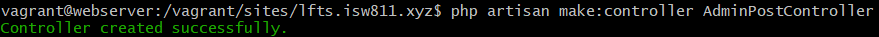
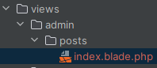
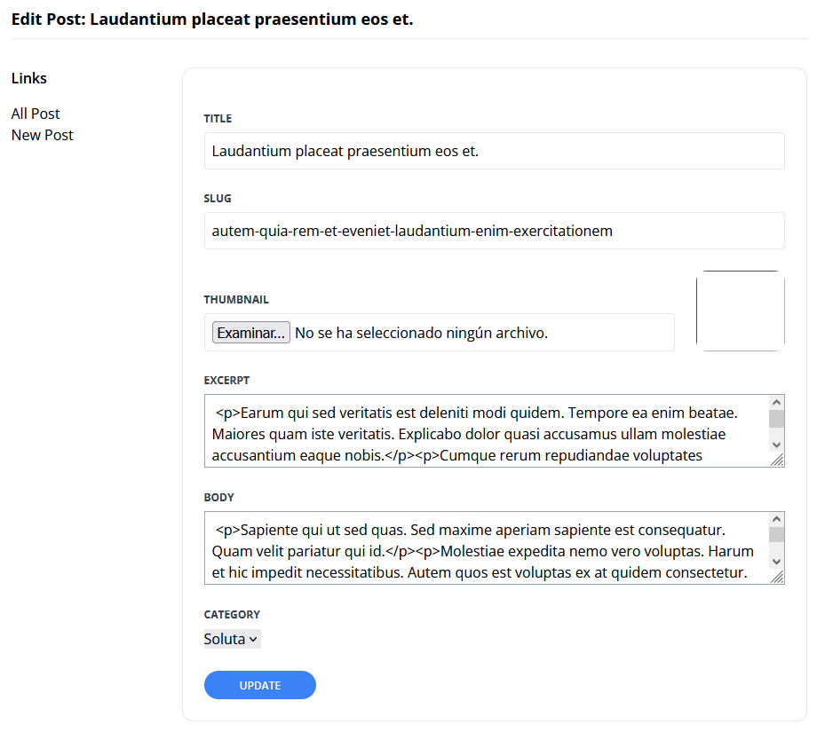

[<--- Volver](/README.md)

# Admin Section

## Limitar acceso solo para administradores / Limit Access to Only Admins

Creamos una nueva ruta en `web.php`

```php
Route::get('admin/posts/create', [PostController::class, 'create']);
```

Luego vamos a PostController para crear la funcion que se encargara de crear los posts
public function create()
    
```php
{
    return view('posts.create');
}
```

Luego creamos la vista create dentro del folder de vistas de posts


Pegamos el siguiente codigo para probar que todo funcione.

```php
<x-layout>
    <section class="px-6 py-8">
        Hello
    </section>
</x-layout>
```

Y probamos en el navegador que todo funcione correctamente


Ahora vamos a filtrar para que no todos puedan acceder a esta funcion

```php
{
    if(auth()->user()?->username=='LuisGomez') {
        abort(Response::HTTP_FORBIDDEN);
    }
    return view('posts.create');
}
```

Ahora nos ndirigimos a nuestra terminal en la Vm webserver y creamos un nuevo middleware

```bash
php artisan make:middleware MustBeAdministrator
```


Ahora la logica de la funcioin create la vamos a mover a este nuevo Middleware

```php
public function handle(Request $request, Closure $next)
    {
        if(auth()->user()?->username=='LuisGomez') {
            abort(Response::HTTP_FORBIDDEN);
        }
        return $next($request);
    }
```

Luego vamos al archivo `Kernel.php` el cual se encutra en la ruta _app/Http_ para annadir nuestro nuevo middleware, este ultimo lo agregamos en `$routeMiddleware `

```php
'admin' => MustBeAdministrator::class;
```


Ahora nos vamos al archivo de rutas y prodremos agregar el middleware admin

```php
Route::get('admin/posts/create', [PostController::class, 'create'])->middleware('admin');
```
Probamos con un usuario que no sea admin


## Crear el formulario para publicar posts / Create the Publish Post Form

En la vista que creamos llamada create en el forlder posts vamos a crear el form para poder publicar nuevos posts

Luego de haber creado todo el form, iremos a web.php a crear la ruta para poder crear los posts

```php
Route::get('admin/posts', [PostController::class, 'store'])->middleware('admin');
```

Luego nos vamos a PostController a crear la funcion con la que los posts se guardaran en la base de datos

```php
    public function store(){
        $attributes = request()->validate([
            'title'=> 'required',
            'slug'=> ['required', Rule::unique('posts', 'slug')],
            'excerpt'=> 'required',
            'body'=> 'required',
            'category_id'=> ['required', Rule::exists('categories', 'id')],
        ]);
        $attributes['user_id'] = auth()->id();
        
        Post::create($attributes);
        return redirect('/');
    }
```

Ahora creamos un post para comprobar que todo este funcionando de la manera correcta


Como vemos todo funciona de la manera correcta.

## Validar y almacenar miniaturas de publicaciones / Validate and Store Post Thumbnails

Agregamos una nueva seccion dentro del form de crear post que se llamara `Thumbnail`, ademas de agregar esto en el form `enctype="multipart/form-data"`

Nos vamos al archivo fylesystems.php que se encuntra en la carpeta config y editamos la linea 16, en la que cambiamos la palabra `local` por `public`

Luego dentro de nuestra terminal de la VM webserver y corremos el comando

```bash
php artisan storage:link
```


Ahora vamos a la migracion de posts para annadir dentro de la misma los thumbnails por lo que el schema quedaria de esta manera

```php
Schema::create('posts', function (Blueprint $table) {
    $table->id();
    $table->foreignId('user_id')->constrained()->cascadeOnDelete();
    $table->foreignId('category_id');
    $table->string('slug')->unique();
    $table->string('title');
    $table->string('thumbnail')->nullable();
    $table->text('excerpt');
    $table->text('body');
    $table->timestamps();
    $table->timestamp('published_at')->nullable();
});
```

Luego refrescamos la base de datos con el comando que corremnos en la terminal de nuestra Vm webserver

```bash
php artisan migrate:fresh
```


Ahora modificamos la funcion para que tambien acepte los nuevos thumbnails

```php
    public function store(){
        $attributes = request()->validate([
            'title'=> 'required',
            'thumbnail'=> 'required|image',
            'slug'=> ['required', Rule::unique('posts', 'slug')],
            'excerpt'=> 'required',
            'body'=> 'required',
            'category_id'=> ['required', Rule::exists('categories', 'id')],
        ]);
        $attributes['user_id'] = auth()->id();
        $attributes['thumbnail'] = request()->file('thumbnail')->store('thumbanails');
        Post::create($attributes);
        return redirect('/');
    }
```
Luego de haber vuelto a crear mi usuario `LuisGomez` que es el admin, vamos a probar a crear un nuevo post cargando una imagen en el mismo


Como vemos en el Workbench la imagen se subio y se guardo de manera correcta dentro de la abse de datos


Ahora debemos cambiar la ruta dentro de nuestra vista show, ya quye estamos cargando un imagen erronea

Asi se veria el posts una vez entramos al mismo


Y asi se veria en la main page una vez se carga de manera correcta la imagen del post


## Extraer componentes blade específicos del formulario / Extract Form-Specific Blade Components

Vamos a extraer cada parte del formulario que esta compuesta por un input, textarea, mensaje de error, label o div que sea repetitivo y vamos a crear componetenes que puedan ser llamados en caso de necesitarlos no tener que escribir todo el codigo de nuevo, para esto creamos un nuevo folder con el nombre de form, dentro de la carpeta, en el que meteremos todos estos componentes.

Codigo del componente input

```php
@props(['name', 'type' => 'text'])
<div class="mb-6">
    <x-form.label name="{{ $name }}"/>
    <input class="border border-gray-400 p-2 w-full"
           type="{{$type}}"
           name="{{$name}}"
           id="{{$name}}"
           value="{{ old('title') }}"
           required
    >
    <x-form.error name {{$name}} />
</div>
```

Codigo del componente textarea

```php
@props(['name'])
<div class="mb-6">
    <x-form.label name="{{ $name }}"/>
    <textarea class="border border-gray-400 p-2 w-full"
           type="text"
           name="{{$name}}"
           id="{{$name}}"
           required
    > {{ old($name) }} </textarea>
    <x-form.error name {{$name}} />
</div>
```

Codigo del componente mensaje de error , este se llamara error

```php
@props(['name'])
@error($name)
    <p class="text-red-500 text-xs me-2">{{ $message }}</p>
@enderror
```

Codigo del componente label

```php
@props(['name'])
<label class="block mb-2 uppercase font-bold text-xs text-gray-700"
       for="{{$name}}">
    {{ucwords($name)}}
</label>
```

Codigo del componente div, este se llamara field

```php
<div class="mt-6">
    {{ $slot }}
</div>
```

Ademas de estos el componente `submit-buttom` pasara a ser `buttom` y su codigo es este

```php
<x-form.field>
    <button type="submit"
            class="bg-blue-500 text-white uppercase font-semibold text-xs py-2 px-10 rounded-2xl hover:bg-blue-600">
        {{ $slot }}
    </button>
</x-form.field>
```

## Ampliar el diseño de administración / Extend the Admin Layout

Comenzamos editando el componente layout para agregar ciertas funcionalidades a la parte del admin

Luego nos vamos a la vista create para extraer ciertas cosas repetitivas que se pueden cambiar por un componente

Codiugo del componente setting

```php
@props(['heading'])
<section class="py-8 max-w-4xl mx-auto">
    <h1 class="text-lg font-bold mb-8 pb-2 border-b">
        {{ $heading }}
    </h1>

    <div class="flex">
        <aside class="w-48 flex-shrink-0">
            <h4 class="font-semibold mb-4">Links</h4>
            <ul>
                <li>
                    <a href="/admin/dashboard" class="{{ request()->is('admin/dashboard') ? 'text-blue-500' : '' }}">Dashboard</a>
                </li>

                <li>
                    <a href="/admin/posts/create" class="{{ request()->is('admin/posts/create') ? 'text-blue-500' : '' }}">New Post</a>
                </li>
            </ul>
        </aside>
        <main class="flex-1">
            <x-panel>
                {{ $slot }}
            </x-panel>
        </main>
    </div>
</section>
```

Ademas de esto cambiamos ciertos aspectos tanto de funcionalidad como de css en create del folder sessions, y en el componente input del folder form

## Crear un formulario para editar y eliminar posts / Create a Form To Edit and Delete Posts

Vamos al archivo de rutas a crear una nueva ruta

```php
Route::get('admin/posts', [AdminPostController::class, 'index'])->middleware('admin');
```

Ahora nos vamos a la terminal de la VM webserver a crear este nuevo controller con el comando

```bash
php artisan make:controller AdminPostController
```



Creamos la funcion index dentro de este nuevo controller

```php
public function index(){
    return view('admin/posts/index', [
        'posts' => Post::paginate(50)
    ]);
}
```

Creamos una nueva vista pero antes de eso debemos crear un nuevo folder llamado `admin`, dentro de este folder creamos otro llamadado `posts` y luego dentro de este ultimo creamos la vista a la que llamaremos `index.blade.php`



Luego movemos  la vista `create` de posts a nuestra nueva ruta _admin/posts_

Y editamos una linea en PostController donde esta referenciada la vista anterior

Editamos la vista `setting` en donde eataba referenciado `dashboard`, lo vamos a cambiar por el nombre `All Post` y la ruta sera _admin/posts_

Luego de haber creado como queremos que se vem los post existentes, vamos al archivo de rutas para crear la ruta que le dara funcionalidad al boton de editar post

```php
Route::get('admin/posts/{post}/edit', [AdminPostController::class, 'edit'])->middleware('admin');
```
Movemos las funciones `create()` y `store()` de PostController a AdminPostController ya que son funcionalidades que solos los administradores pueden utilizar, ademas de esto tenemos que editar las rutas para que utilicen el controller necesario al acceder a estas funcionalidades

```php
Route::get('admin/posts/create', [AdminPostController::class, 'create'])->middleware('admin');
Route::post('admin/posts', [AdminPostController::class, 'store'])->middleware('admin');
```

Creamos una nueva funcion dentro de AdminPostController con la que le daremos funcionalidad a el endpoint de editar

```php
public function edit(Post $post)
    {
        return view('admin.posts.edit', ['post' => $post]);
    }

```
Creamos la vista para poder editar los posts, podemos reutilizar el codigo de `create`

Asi se veria la vista de edit al editar un poco el codig



Creamos otra ruta mas, esta sera para hacer el update de 

```php
Route::patch('admin/posts/{post}', [AdminPostController::class, 'update'])->middleware('admin');
```

Y tambien creamos la respectiva funcion en AdminPostController que le dara funcionalidad a esta ruta

```php
public function update(Post $post) {
    $attributes = request()->validate([
        'title'=> 'required',
        'thumbnail'=> 'required|image',
        'slug'=> ['required', Rule::unique('posts', 'slug')->ignore($post->id)],
        'excerpt'=> 'required',
        'body'=> 'required',
        'category_id'=> ['required', Rule::exists('categories', 'id')],
    ]);
    if(isset($attributes['thumbnail'])) {
        $attributes['thumbnail'] = request()->file('thumbnail')->store('thumbnails');
    }
    $post->update($attributes);
     return back()->with('success', 'Post Updated');
}
```
Y ahora podemos actualzar nuestros posts

Creamos el endpoint para poder eliminar posts

```php
Route::delete('admin/posts/{post:id}', [AdminPostController::class, 'destroy'])->middleware('admin');
```

Creamos la funcion para eliminar posts

```php
public function destroy(Post $post)
    {
        $post->delete();

        return back()->with('success', 'Post Deleted!');
    }
```

Y ahora podemos eliminar posts.

## Agrupar logica de validacion de Store / Group and Store Validation Logic

Las funciones update() y store() dentro del controller AdminPostController basicamente tienen la misma logica a excepcion de unas lineas de codigo, por lo que vamos a crear una nueva funcion llamada validatePost que se encargara de validar la informacion del post.

Codigo de la funcion validatePost()

```php
public function validatePost(Post $post):array {
        return request()->validate([
            'title'=> 'required',
            'thumbnail'=> $post->exists ? ['image'] : ['required', 'image'],
            'slug'=> ['required', Rule::unique('posts', 'slug')->ignore($post->id)],
            'excerpt'=> 'required',
            'body'=> 'required',
            'category_id'=> ['required', Rule::exists('categories', 'id')],
            'published_at' => 'required'
        ]);
    }
```

Editamos la funcion store()

```php
public function store(){
    Post::create(array_merge($this->validatePost(), [
        'user_id' => request()->user()->id,
        'thumbnail' => request()->file('thumbnail')->store('thumbnails')
    ]));
    return redirect('/');
}
```

Editamos la funcion update()

```php
public function update(Post $post) {
    $attributes = $this->validatePost($post);
    if ($attributes['thumbnail'] ?? false) {
        $attributes['thumbnail'] = request()->file('thumbnail')->store('thumbnails');
    }
    $post->update($attributes);
    return back()->with('success', 'Post Updated');
}
```

##

```php

```