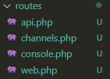
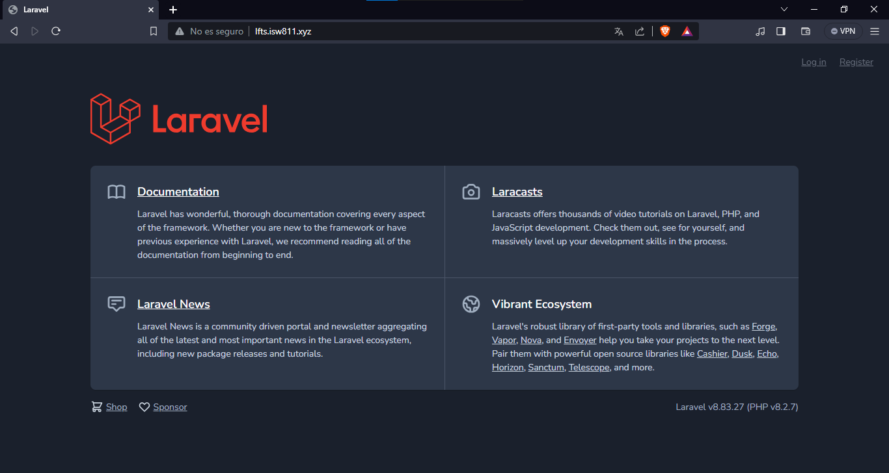
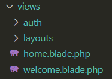
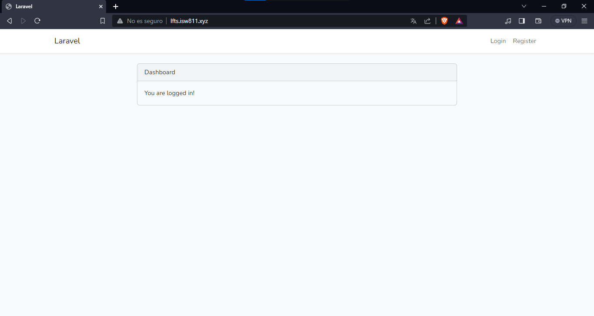
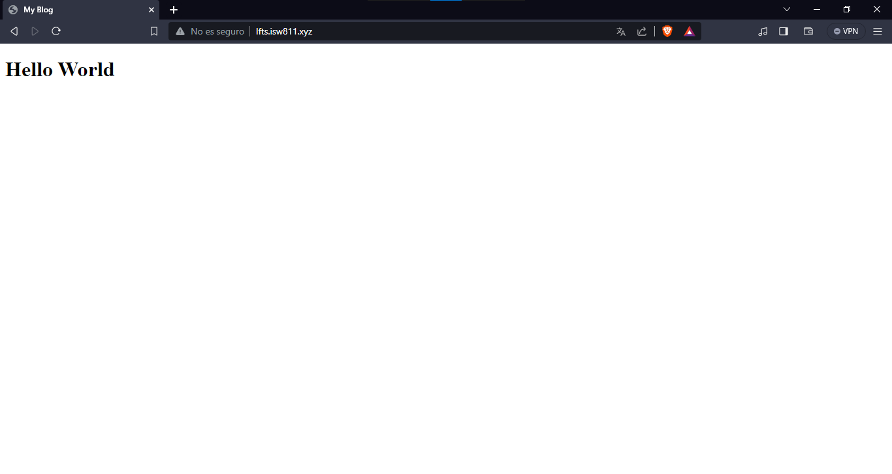
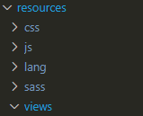
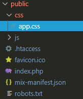
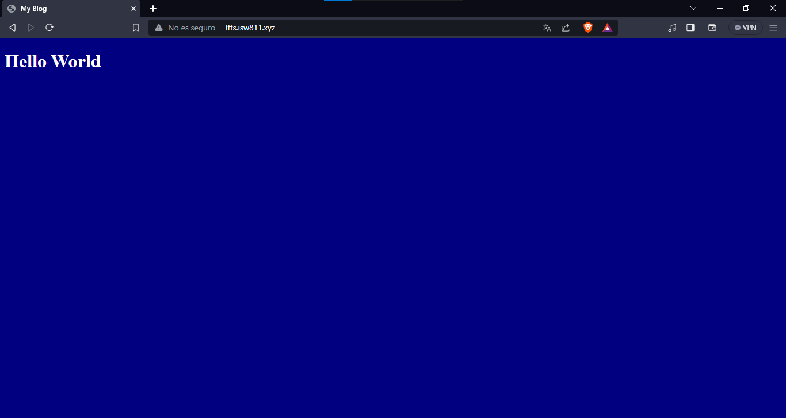
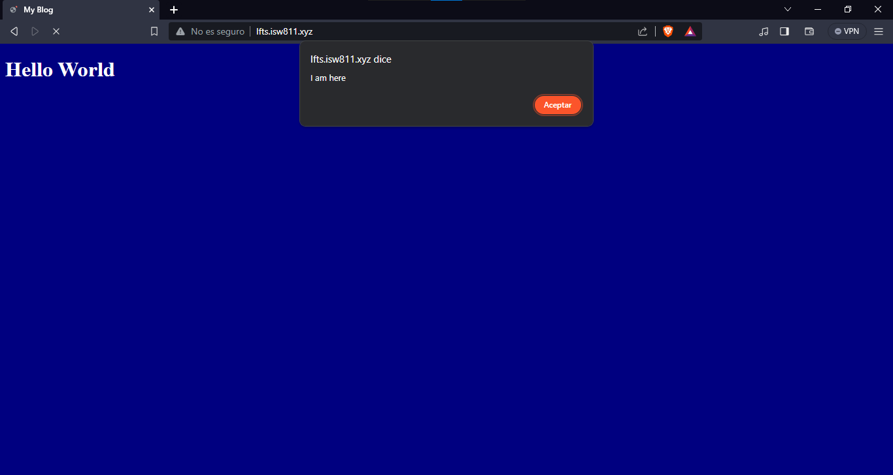

[<--- Volver](/README.md)

# The Basics

## Como una ruta carga una vista / How a route load a view

En el directorio de nuestro proyecto hay varias carpertas, para el tema de rutas nos interesan estas dos es particular `routes` y `resources/views`

En la primer carpeta la cual se llama `routes` podemos encontrar los siguientes archivos, el que nos interesa es el el llamado `web.php` ya que ese archivo es el que maneja las rutas de nustra pagina web.



En este archivo podemos encontrar el siguiente codigo que es el encargado de cargar la informacion que se despliega en la pagina principal de nuestra web.

```php
 
```

En el return de la función podemos ver un archivo llamado `'welcome'`, ese archivo es el que contiene todo el html que se despliega en la pagina de inicio


Ese archivo es importado desde la carpeta `resources/views` y el archivo que contiene todo el html para desplegar el contenido de la pagina se llama `welcome.blade.php` solo que al colocarlo en la funcion solo hace falta poner el primer nombre antes del primer punto.



Cualquier cambio producido en el archivo `welcome.blade.php` se verá reflejado en `web.php` al momento de cargar la pagina.

De igual manera, un cambio producido en el return de la función comentada lineas arriba, se vera reflejado en la pagina de incio al cargar la pagina web. Por ejemplo: cambiamos el archivo `'welcome'` por el archivo `'home'`

```php
Route::get('/', function () {
    return view('home');
});

Auth::routes();

Route::get('/home', [App\Http\Controllers\HomeController::class, 'index'])->name('home');

```

Ahora podemos visualizar que en nuestra main page lo que se carga es la pagina `home` en lugar de la página `welcome`



## Incluir CSS y JavaScript / Include CSS and JavaScript

Este es el segundo video del modelo The Basics en el que vamos a incluir CSS y JavaScript basicos a una vista de nuestra pagina web.

Para empezar vamos a cambiar el contenido del archivo `welcome.blade.php` por este codigo basico

```html
<!DOCTYPE html>
<html lang="en">
<head>
    <meta charset="UTF-8">
    <meta name="viewport" content="width=device-width, initial-scale=1.0">
    <title>My Blog</title>
</head>
<body>
    <h1>Hello World</h1>
</body>
</html>
```

Y asi se veria nuestro sitio web con los cambios en el codigo



En la carpeta de `resources` podemos encontrar dos carpetas llamadas `css` y `js` pero de momento vamos a ignorarlas.



Nos vamos a concentrar en la carpeta `public` ya que dentro de esta en una carpeta llamada `css` tenemos un archivo css que es el que vamos a manipular para cambiar el diseño de la web.



En el respectivo archivo css agregamos este epqueño codigo

```css
body {
    background: navy;
    color: white
}
```

Luego nos movemos a nuestro archivo `welcome` y linkeamos el archivo app.css para poder visualizar los cambios en el diseño de la pagina

```html
<!DOCTYPE html>
<html lang="en">
<head>
    <meta charset="UTF-8">
    <meta name="viewport" content="width=device-width, initial-scale=1.0">
    <link rel="stylesheet" href="./css/app.css">
    <title>My Blog</title>
</head>
<body>
    <h1>Hello World</h1>
</body>
</html>
```

Y podemos visualizar como cambia nuestra web 



Para añadir JavaScript es el mismo proceso, solamente cambiando la carpeta `css` por la llamada `js` y el archivo `app.css` por el archivo `app.js`

En `app.js` añadimos el siguiente codigo 

```js
alert('I am here');
```

Linkeamos nuestro archivo js con el archivo welcome.

```html
<!DOCTYPE html>
<html lang="en">
<head>
    <meta charset="UTF-8">
    <meta name="viewport" content="width=device-width, initial-scale=1.0">
    <link rel="stylesheet" href="./css/app.css">
    <title>My Blog</title>
</head>
<body>
    <h1>Hello World</h1>
</body>
<script src="./js/app.js"></script>
</html>
```

Y ahora al entrar en la web se desplegaria la alerta



