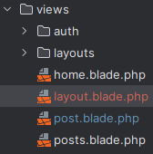
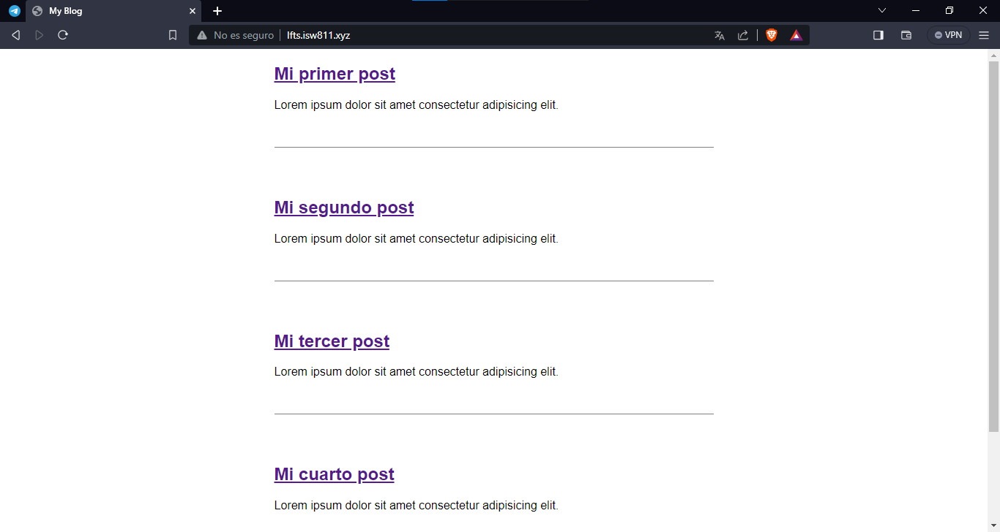
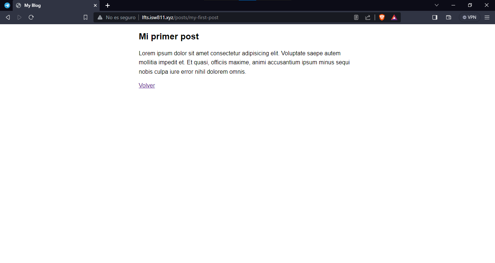
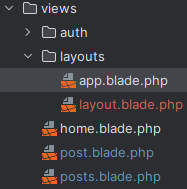

[<--- Volver](/README.md)

# Blade

## Los basicos absolutos / Blade: The absolute basics

Para iniciar con los basicos vamos a cambiar el codigo de ``posts.blade.php``

```php
<!DOCTYPE html>
<html lang="en">
<head>
    <meta charset="UTF-8">
    <meta name="viewport" content="width=device-width, initial-scale=1.0">
    <link rel="stylesheet" href="./css/app.css">
    <title>My Blog</title>
</head>

<body>

    <?php foreach ($posts as $post) : ?>
        <article>
            <h1> <a href="/posts/{{ $post->slug }}"> {{$post->title}} </a> </h1>
            <div>
                    {{$post->excerpt}}
            </div>

        </article>

    <?php endforeach; ?>

</body>
</html>


```

Y también de post.blade.php
```php
<!DOCTYPE html>
<html lang="en">
<head>
    <meta charset="UTF-8">
    <meta name="viewport" content="width=device-width, initial-scale=1.0">
    <link rel="stylesheet" href="/css/app.css">
    <title>My Blog</title>
</head>

<body>
    <article>

    <h1> {{ $post->title }} </h1>

        <div>
            {!! $post->body !!} // En este caso le ponemos !! ya que si no lo hacemos se visualizan las etiquetas del body.
        </div>

    </article>

    <a href="/">Volver</a>

</body>
</html>
```

Y como vemos la ágina sigue compilando de la misma manera


Esto gracias a la extensión .blade de nuestros archivos.


También podemos realizar estos cambios para mejorar la apariencia del codigo en posts.blade.php

```php
@foreach ($posts as $post)

@endforeach
```

## Diseños blade de dos maneras / Blade layouts two ways

Creamos una nueva vista llamada ``layout`` en la carpeta de Views



Le agregamos el siguiente codigo
```html
<!DOCTYPE html>
<html lang="en">
<head>
    <meta charset="UTF-8">
    <meta name="viewport" content="width=device-width, initial-scale=1.0">
    <link rel="stylesheet" href="./css/app.css">
    <title>My Blog</title>
</head>

<body>
    @yield('content')
</body>
</html>
```

Ahora modificamos el archivo posts de la siguiente manera

```php
@extends('layout')

@section('content')
    @foreach ($posts as $post)
        <article>
            <h1> <a href="/posts/{{ $post->slug }}"> {{$post->title}} </a> </h1>
            <div>
                {{$post->excerpt}}
            </div>
        </article>
    @endforeach
@endsection
```

Ahora modificamos el archivo post

```php
@extends('layout')

@section ('content')
    <article>

        <h1> {{ $post->title }} </h1>

        <div>
            {!! $post->body !!}
        </div>

    </article>

    <a href="/">Volver</a>
@endsection
```

Y como podemos ver todo la pagina sigue comportandose de la misma manera, solo que el codigo se ha vuelto muvho ams limpio.





Ahora vamos a mover el archivo `layout.balde.php` dentro de la carpeta layouts



Vamos a modificar el codigo del archivo `layout.balde.php`

```php
<!DOCTYPE html>
<html lang="en">
<head>
    <meta charset="UTF-8">
    <meta name="viewport" content="width=device-width, initial-scale=1.0">
    <link rel="stylesheet" href="/css/app.css">
    <title>My Blog</title>
</head>

<body>
{{ $content }}
</body>
</html>
```

También modificamos el archivo posts donde a entender que también pueden utilizarse los layouts de esta manera

```php
<x-layout>
    @foreach ($posts as $post)
        <article>
            <h1><a href="/posts/{{ $post->slug }}"> {{$post->title}} </a></h1>
            <div>
                {{$post->excerpt}}
            </div>
        </article>
    @endforeach
</x-layout>
```

Aunque a mi de este modo no me funcionó :(

## Algunos ajustes y consideraciones / A few tweaks and consideration

Empezamos removiendo este trozo de codigo del archico `web.php`

```php
->where('post', '[A-z_\-]+');
```

Ahora vamos a crear una nueva función en la clase Post que se llamará `findOrFail` que se encargará de dar error en la pagina si la ruta no es valida. Esta llevará este código.

```php
public static function findOrFail($slug) {
    $post = static::find($slug);
        
    if (! $post) {
        throw new ModelNotFoundException();
    }
    
    return $post;
}
```

Y en el archivo ``web.php`` cambiamos lo siguiente para que al momento de entrar en un post o uns ruta inexistente se dispare el error de ser necesario.

```php
Route::get('posts/{post}', function ($slug) {

    return view('post', [
        'post' => Post::findOrFail($slug)
    ]);
});
```