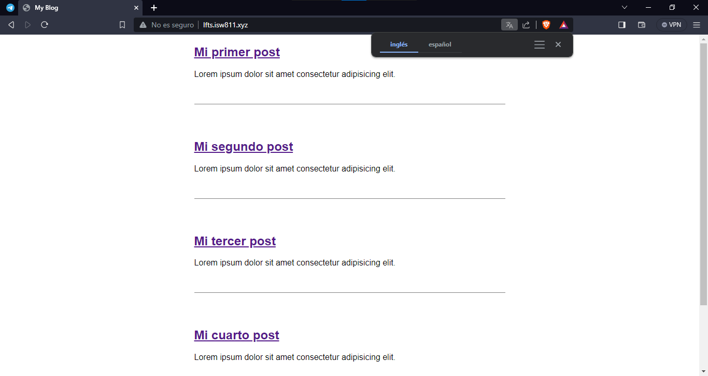
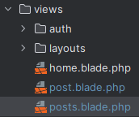

[<--- Volver](/README.md)

# Blade

## Los basicos absolutos / Blade: The absolute basics

Para iniciar con los basicos vamos a cambiar el codigo de ``posts.blade.php``

```php
<!DOCTYPE html>
<html lang="en">
<head>
    <meta charset="UTF-8">
    <meta name="viewport" content="width=device-width, initial-scale=1.0">
    <link rel="stylesheet" href="./css/app.css">
    <title>My Blog</title>
</head>

<body>

    <?php foreach ($posts as $post) : ?>
        <article>
            <h1> <a href="/posts/{{ $post->slug }}"> {{$post->title}} </a> </h1>
            <div>
                    {{$post->excerpt}}
            </div>

        </article>

    <?php endforeach; ?>

</body>
</html>


```

Y también de post.blade.php
```php
<!DOCTYPE html>
<html lang="en">
<head>
    <meta charset="UTF-8">
    <meta name="viewport" content="width=device-width, initial-scale=1.0">
    <link rel="stylesheet" href="/css/app.css">
    <title>My Blog</title>
</head>

<body>
    <article>

    <h1> {{ $post->title }} </h1>

        <div>
            {!! $post->body !!} // En este caso le ponemos !! ya que si no lo hacemos se visualizan las etiquetas del body.
        </div>

    </article>

    <a href="/">Volver</a>

</body>
</html>
```

Y como vemos la ágina sigue compilando de la misma manera



Esto gracias a la extensión .blade de nuestros archivos.



También podemos realizar estos cambios para mejorar la apariencia del codigo en posts.blade.php

```php
@foreach ($posts as $post)

@endforeach
```

## Diseños blade de dos maneras / Blade layouts two ways

## Algunos ajustes y consideraciones / A few tweaks and consideration