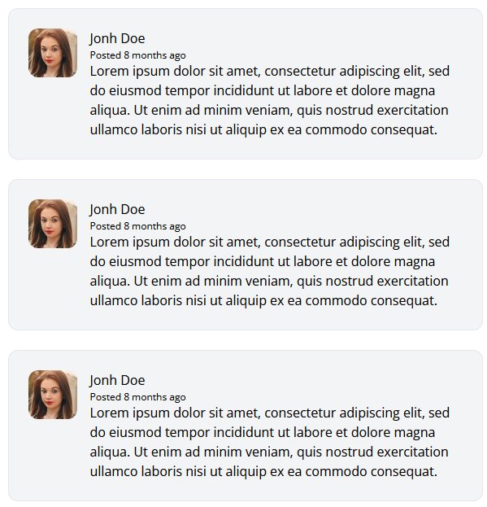
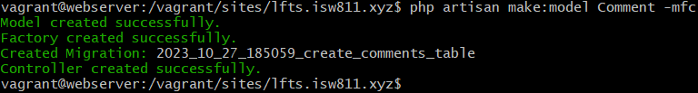
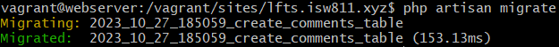
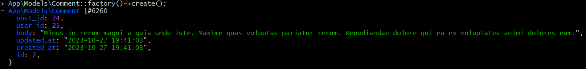
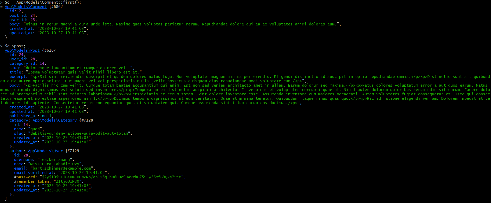

[<--- Volver](/README.md)

# Comments

## Escriba el margen para comentarios en los post / Write the markup for a Post Comment

Vamos al archivo show en la carpeta posts y modificamos para agregar una nueva seccion para los comentarios

```php
<article class="flex bg-gray-100 border border-gray-200 p-6 rounded-xl space-x-4">
    <div class="flex-shrink-0">
        
    </div>
    <div>
        <header>
            <h3 class="fonr-bold">Jonh Doe</h3>
            <p class="text-xs">
                Posted
                <time>8 months ago</time>
            </p>
        </header>
        <p>
            Lorem ipsum dolor sit amet, consectetur adipiscing elit, sed do eiusmod tempor incididunt ut labore et dolore magna aliqua. Ut enim ad minim veniam, quis nostrud exercitation ullamco laboris nisi ut aliquip ex ea commodo consequat.
         </p>
    </div>
</article>
```

Este seria solo la base para crear la seccion de comentarios, este codigo lo vamos a mover a un componentesque llamaremos `post-comment`

Asi se veria los comentarios de los posts dentro del post



## Consistencia de tablas y restricciones de clave externa / Table Consistency and Foreign Key Constraints

Desde la terminal de la VM webserver vamos a crear un nuevo modelo y le vamos a agregar -mfc que significa
- m = migration
- f = factory
- c = controller



Ahora nos dirigimos a la migracion de Comment para modificarla con las columnas que queremos que lleva la tabla

```php
    Schema::create('comments', function (Blueprint $table) {
        $table->id();
        $table->foreignId('post_id')->constrained()->cascadeOnDelete();
        $table->foreignId('user_id')->constrained()->cascadeOnDelete();
        $table->unsignedBigInteger('user_id');
        $table->text('body');
        $table->timestamps();
    });
```

Nos movemos a la terminal de la VM webserver y corremos el comando para migrar la tabla a la base de datos
```bash
php artisan migrate
```



## Hacer que los comentarios sean dinamicos / Make the Comments Section Dynamic

Editamos la fabrica de comments para que se creem los datos de la forma que queremos dentro de la base de datos

```php
public function definition()
    {
        return [
            'name' => $this->faker->word(),
            'slug' => $this->faker->slug()
        ];
    }
```
Nos movemos a la terminal de la Vm webserver para crear un comment con los comandos

```bash
php artisan tinker
App\Models\Comment::factory()->create();
```



Ahora despues de crear el comment vamos a el modelo Post para agregar la relacion con el comment

```php
public function comments() {
    return $this->hasMany(Comment::class);
}
```

Ahora vamos al modelo Comment y creamos las relaciones con Post y Author

```php
public function post() {
    return $this->belongsTo(Post::class);
}
public function author() {
    return $this->belongsTo(User::class, 'user_id');
}
```

Y vemos como tiene relacion con el Post 



Ahora nos dirigimos a la vista show para emepezar con los comentarios dinamicos, el primer cambio que haremos sera este

```php
@foreach($post->comments as $comment)
    <x-post-comment :comment="$comment" />
@endforeach
```

Ahora nos vamos al componente post-comment

```php

```