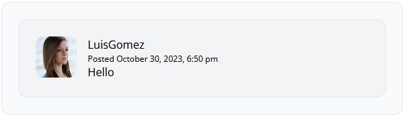

[<--- Volver](/README.md)

# Comments

## Escriba el margen para comentarios en los post / Write the markup for a Post Comment

Vamos al archivo show en la carpeta posts y modificamos para agregar una nueva seccion para los comentarios

```php
<article class="flex bg-gray-100 border border-gray-200 p-6 rounded-xl space-x-4">
    <div class="flex-shrink-0">
        
    </div>
    <div>
        <header>
            <h3 class="fonr-bold">Jonh Doe</h3>
            <p class="text-xs">
                Posted
                <time>8 months ago</time>
            </p>
        </header>
        <p>
            Lorem ipsum dolor sit amet, consectetur adipiscing elit, sed do eiusmod tempor incididunt ut labore et dolore magna aliqua. Ut enim ad minim veniam, quis nostrud exercitation ullamco laboris nisi ut aliquip ex ea commodo consequat.
         </p>
    </div>
</article>
```

Este seria solo la base para crear la seccion de comentarios, este codigo lo vamos a mover a un componentesque llamaremos `post-comment`

Asi se veria los comentarios de los posts dentro del post


## Consistencia de tablas y restricciones de clave externa / Table Consistency and Foreign Key Constraints

Desde la terminal de la VM webserver vamos a crear un nuevo modelo y le vamos a agregar -mfc que significa
- m = migration
- f = factory
- c = controller


Ahora nos dirigimos a la migracion de Comment para modificarla con las columnas que queremos que lleva la tabla

```php
    Schema::create('comments', function (Blueprint $table) {
        $table->id();
        $table->foreignId('post_id')->constrained()->cascadeOnDelete();
        $table->foreignId('user_id')->constrained()->cascadeOnDelete();
        $table->unsignedBigInteger('user_id');
        $table->text('body');
        $table->timestamps();
    });
```

Nos movemos a la terminal de la VM webserver y corremos el comando para migrar la tabla a la base de datos
```bash
php artisan migrate
```


## Hacer que los comentarios sean dinamicos / Make the Comments Section Dynamic

Editamos la fabrica de comments para que se creem los datos de la forma que queremos dentro de la base de datos

```php
public function definition()
    {
        return [
            'name' => $this->faker->word(),
            'slug' => $this->faker->slug()
        ];
    }
```
Nos movemos a la terminal de la Vm webserver para crear un comment con los comandos

```bash
php artisan tinker
App\Models\Comment::factory()->create();
```


Ahora despues de crear el comment vamos a el modelo Post para agregar la relacion con el comment

```php
public function comments() {
    return $this->hasMany(Comment::class);
}
```

Ahora vamos al modelo Comment y creamos las relaciones con Post y Author

```php
public function post() {
    return $this->belongsTo(Post::class);
}
public function author() {
    return $this->belongsTo(User::class, 'user_id');
}
```

Y vemos como tiene relacion con el Post 


Ahora nos dirigimos a la vista show para emepezar con los comentarios dinamicos, el primer cambio que haremos sera este

```php
@foreach($post->comments as $comment)
    <x-post-comment :comment="$comment" />
@endforeach
```

Ahora nos vamos al componente post-comment

```php
@props()
<article class="flex bg-gray-100 border border-gray-200 p-6 rounded-xl space-x-4">
    <div class="flex-shrink-0">
        
    </div>
    <div>
        <header>
            <h3 class="fonr-bold">{{ $comment->author->username }}</h3>
            <p class="text-xs">
                Posted
                <time>{{ $comment->created_at }}</time>
            </p>
        </header>
        <p> {{ $comment->body }} </p>
    </div>
</article>
```

Y vemos como dentro de la web tenemos un coe=mentario dinamico


## Disennar el formulario para comentarios / Design the Comment Form

Lo primero sera ir a la vista show y crear un form ahi que sera donde se ingresen los comentarios

```php
                    <form action="POST" action="#" class="border border-gray-200 p-6 rounded-xl">
                        @csrf
                        <header class="flex items-center">
                            id() }}" alt="" width="60" height="60" class="rounded-xl">
                            <h2 class="ml-4">Want to participate?</h2>
                        </header>
                        <div class="mt-6">
                            <textarea name="body" class="w-full text-sm focus:outline-none focus:ring" rows="5" placeholder="Quick, thing of something to say"/>
                        </div>
                        <div class="flex justify-end mt-6 pt-6 border-t border-gray-200">
                            <button type="submit" class="bg-blue-500 text-white uppercase font-semibold text-xs py-2 px-10 rounded-2xl hover:bg-blue-600"/>
                        </div>
                    </form>
```

Ahora creamos un componente al que llamaremos panel y le ponemos este codigo

```php
<div class="border border-gray-200 p-6 rounded-xl">
    {{ $slot }}
</div>
```

Y al codigo anterior lo metemos entre las etiquetas `<x-panel>`

El codigo de post-comment tambien lo metemos entre esas mismas etiquetas
```php
<x-panel class="bg-gray-50">
    <article class="flex bg-gray-100 border border-gray-200 p-6 rounded-xl space-x-4">
        <div class="flex-shrink-0">
            id }}" alt="" width="60" height="60" class="rounded-xl">
        </div>
        <div>
            <header>
                <h3 class="fonr-bold">{{ $comment->author->username }}</h3>
                <p class="text-xs">
                    Posted
                    <time>{{ $comment->created_at }}</time>
                </p>
            </header>
            <p> {{ $comment->body }} </p>
        </div>
    </article>
</x-panel>
```
Por ultimo, asi quedaria el form estilizado.


## Activar el formulario de comentarios / Activate the Comment Form

Annadimos una nueva endpoint en `web.php` para poder agregar los comentarios

```php
Route::post('posts/{post:slug}/comments', [PostCommentController::class, 'store']);
```

Vamos a crear un nuevo controller con el nombre que le dimos en el endpoint

```bash
php artisan make:controller PostCommentsController
```


En la vista show, actualizamos esta linea

```php
<form action="POST" action="/posts/{{ $post->slug }}/comments">
```

Ahora dentro de este nuevo controller creamos lo necesario para que el form funcione

```php
public function store(Post $post) {
    request()->validate([
       'body' => 'required'
    ]);
    $post->comments()->create([
        'user_id' => request()->user()->id,
        'body' => request('body')
    ]);
    return back();
}
```

Esto nos dara un error y para resolverlo lo que tendremos que hacer es annadir esta linea de codigo al Model de Comment

```php
protected $guarded = [];
```

Tambien se puede hacer de la siguiente forma, vamos a la ruta _/app/Providers/_ y al archivo `AppServiceProviders` y en la funcion `boot()` agregamos

```php
Model::unguard();
```
Y asi se verian los comentarios de los post 



Ahora que haremos sera una condicional para evitar que personas que no se encuentran logueadas puedan escribir comentarios, ya que si lo hacen la pagina se cae. Para esto lo que haremos sera mete toda la logica de la vista del form de comentarios dentro de un `@auth` y agregar un link para loguearse en la seccion de comentarios.

```php
<a href="/register" class="hover:underline">Register</a> or <a href="/login" class="hover:underline">log in </a> to leave a comment.
```

## Un poco de limpieza del capítulo / Some Light Chapter Clean Up

Agregamos mensaje de error en caso de que sea un comentario vacio 

```php
@error('body')
    <span class="text-xs text-red-500">{{ $message }}</span>
@enderror
```

Extraemos el codigo del form de comentarios y lo annadimos a una nueva vista que crearemos para este, el cual se llamara `add-comment-form`, lo llamaremos dentro de la vista show con `@include`


Extraemos el boton de add-comment, para nada mas llamarlo la proxima vez que necesitemos un boton, por lo que crearemos un nuevo componente llamado `submit-buttom.blade.php`

