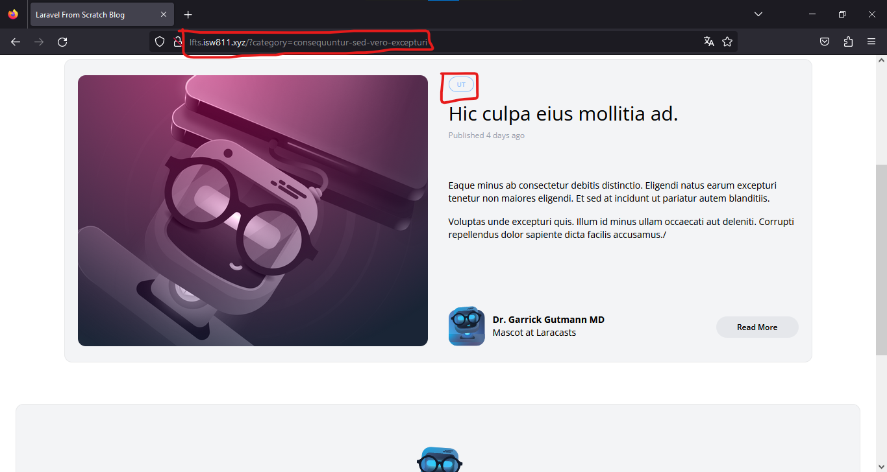
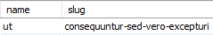
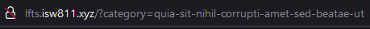
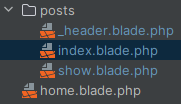
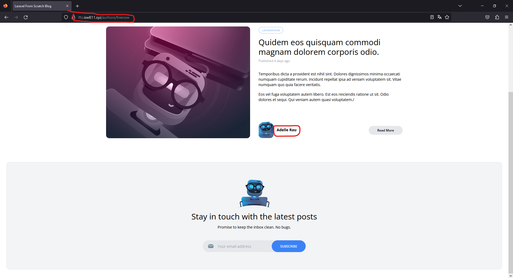
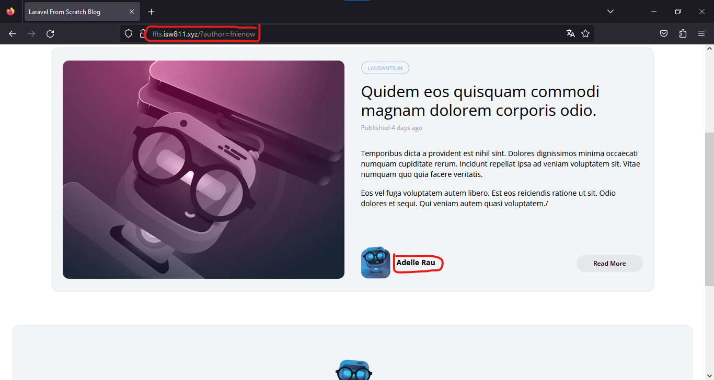

[<--- Volver](/README.md)

# Filtering

## Restricciones de consulta elocuente avanzada / Advanced Eloquent Query Constrainst

Moficamos en PostController la funcion index para que tambien se habilite la busqueda por categorias

```php
public function index() {

    return view('posts', [
        'posts' => Post::latest()->filter(request(['search', 'category']))->get(),
        'categories' => Category::all()
    ]);
 }
```

Y añadimos u nuevo filtro en la funcion scopeFilter() en la clase Post

```php
public function scopeFilter($query, array $filters) {

    $query->when($filters['search'] ?? false, fn($query, $search) =>
        $query->where('title', 'like', '%' . $search . '%')
              ->orWhere('body', 'like', '%' . $search . '%'));

    $query->when($filters['category'] ?? false, fn($query, $category) =>
        $query
            ->whereExists(fn($query) =>
                $query->from('categories')
                    ->whereColumn('categories.id', 'posts.category_id')
                    ->where('categories.slug', $category))
       );
}
```

Como vemos, buscamos por medio de la URL y este nos muestra el post con la categoria correcta.


En este caso la catgoria y el slug no son los mismos pero si revisamo en workbench veremos que ese slug equivale a esa categoria



Otra manera un poco mas limpia de utilizar el mismo query es la siguiente

```php
public function scopeFilter($query, array $filters) {

        $query->when($filters['search'] ?? false, fn($query, $search) =>
            $query->where('title', 'like', '%' . $search . '%')
                  ->orWhere('body', 'like', '%' . $search . '%'));

        $query->when($filters['category'] ?? false, fn($query, $category) =>
            $query
                ->whereHas('category', fn ($query) =>
                    $query->where('slug', $category)
                )
        );
    }
```

Ahora vamos a post-header y vamos a actualizar el metodo por el que buscamos las categorias

```php
<x-dropdown-item
        href="/?category={{ $category->slug }}"
            :active="request()->is('categories/' . $category->slug)"
        >{{ ucwords($category->name) }}
</x-dropdown-item>
```
Ahora volvemos a la pagina y buscamos por medio de categorias y veremos que la URL será el nuevo metodo y no el antiguo



En PostController a la funcion index agregamos lo siguiente

```php
public function index() {
     return view('posts', [
        'posts' => Post::latest()->filter(request(['search', 'category']))->get(),
        'categories' => Category::all(),
        'currentCategory' => Category::firstWhere('slug', request('category'))
    ]);
}
```

Por ultimo en web.php eliminamos la ruta de las categorías por lo que el archivo quedaría asi

```php
Route::get('/', [PostController::class, 'index'])->name('home');

Route::get('posts/{post}', [PostController::class, 'show']);

Route::get('authors/{author:username}', function (User $author) {

    return view('posts', [
        'posts' => $author->posts,
        'categories' => Category::all()
    ]);
});
```

## Extraer un componente de hoja desplegable de categoría / Extract a Category Dropdown Blade Component

Lo primero que haremos será crear un nuevo componente llamado `category-dropdown` lo podemos crear de la siguiente manera desde la terminal de nuestra VM webserver en la ruta de nuestro proyecto

```bash
php artisan make:component CategoryDropdown
```

Pegamos toda la logica del dropdown dentro de este nuevo componente

Dentro de _app/View/Components_ se creó un nuevo componente al que agregaremos el siguiente codigo

```php
public function render()
    {
        return view('components.category-dropdown', [
            'categories' => Category::all()
        ]);
    }
```

Modificamos le archivo web.php ya que mo necesitamos pasar las categorias por la ruta

```php
Route::get('/', [PostController::class, 'index'])->name('home');

Route::get('posts/{post}', [PostController::class, 'show']);

Route::get('authors/{author:username}', function (User $author) {

    return view('posts', [
        'posts' => $author->posts
    ]);
});
```

Y en PostController modificamos también

```php
public function index() {

    return view('posts', [
        'posts' => Post::latest()->filter(request(['search', 'category']))->get()
    ]);
}
```

Movemos el trozo de codigo de que eliminamos de PostController y lo movemos al componente de CategoryDropdown ya que esté será quien se encargue de las categorias

```php
public function render()
    {
        return view('components.category-dropdown', [
            'categories' => Category::all(),
            'currentCategory' => Category::firstWhere('slug', request('category'))
        ]);
    }
```

Dentro de la carpeta _resources/views_ vamos a crar una carpeta llamada posts parar guardar las vistas de los post y renombramos las vistas



Esto para que se llamen como sus respectivas funciones dentro del PostControllerS

## Filtro de autores / Author Filtering

Lo primero qur haremos será ir a post-card y post-featured-card buscar donse se carga el nombre del autor para coonvertirlo en un link 

```php
<h5 class="font-bold">
<a href="/authors/{{ $post->author->username }}">{{ $post->author->name }}</a>
</h5>
```

Luego en el archivo de rutas modificamos lo cambiado anteriormente en PostController

```php
Route::get('authors/{author:username}', function (User $author) {

    return view('posts.index', [
        'posts' => $author->posts
    ]);
});
```

Vemos en la web como la darle click al autor nos lleva a una pagina donde están los posts de ese mismo autor



Ahora nos movemos a la clase post para añadir el autor en la funcion filter para posteiormente poder buscar de la misma manera en la que lo hacemos con las categorias

```php
$query->when($filters['author'] ?? false, fn($query, $author) =>
    $query
        ->whereHas('author', fn ($query) =>
        $query->where('username', $author)
    )
);
```

Luego en PostController también agregamos el autor,al igual que lo hicimos con las palabras y las categorias

```php
public function index() {
    return view('posts.index', [
        'posts' => Post::latest()->filter(request(['search', 'category', 'author']))->get()
    ]);
}
```

Luego vamos a la web e intentamos buscar por medio del query de la URL



Iremos a la vista show para que al ingresar al post el nombre del autor también sea un link que nos redirija a los posts de ese autor

Modificamos el url para que busque de la misma manera ne la que lo hacemos con las palabras y las categorias

<h5 class="font-bold">
<a href="/?author={{ $post->author->username }}">{{ $post->author->name }}</a>
</h5>

Y por ultimo eliminamos el endpoint de authors que tenemos en nuestro archivo de rutas ya que no lo necesitaremos

```php
Route::get('/', [PostController::class, 'index'])->name('home');

Route::get('posts/{post}', [PostController::class, 'show']);
```

##

##

##

##