[<--- Volver](/README.md)

# Forms and Authentication

## Construir una pagina de registro de usuarios / Build a Register User Page

Necesitamos una pagina para registrar usuarios en nuestra web, por lo que vamos a crear una nueva ruta en el archivo web.php

```php
Route::get('register', [RegisterController::Class, 'create']);
```

Ahora nos vamos a la terminal de la VM webserver a crear el nuevo controlador por medio de comandos

```php
php artisan make:controller RegisterController
```
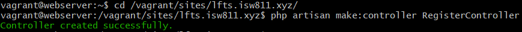

En RegisterController creamos la siguiente función

```php
public function create() {
    return view('register.create');
}
```

Y ahora creamos la nueva vista

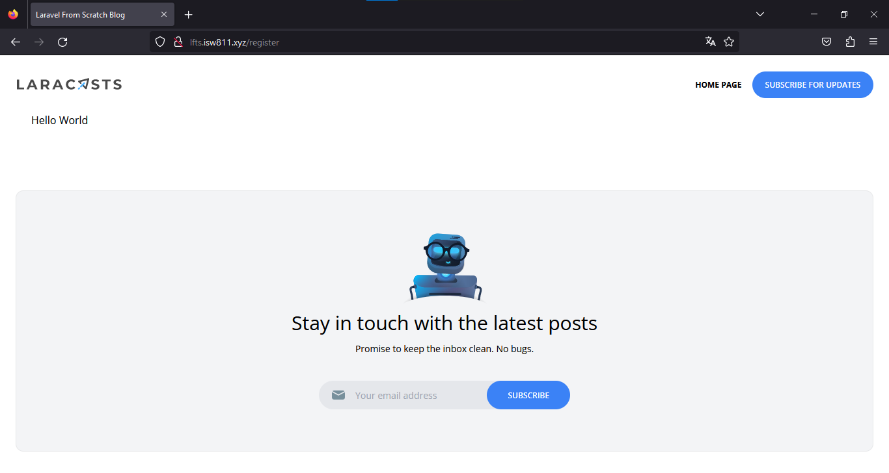

Como podemos observar al poner _/register_ en la URL de la pagina, esta nos redirige a la vista que creamos.

Luego de crear el formulario en el que vamos a registrar los usuarios, nos movemos al arcihov de rutas ``web.php`` para que el endpoint admita request de tipo POST

```php
Route::post('register', [RegisterController::Class, 'store']);
```

Ahora nos movemos al RegisterController y creamos una nueva funcion()

```php
public function store() {
        $attributes = request()->validate([
            'name' => 'required|max:255',
            'username' => 'required|max:255|min:3',
            'email' => 'required|email|max:255',
            'password' => 'required|min:7|max:255',
        ]);

        User::create($attributes);

        return redirect('/');
    }
```
Ahora vamos a nuestra pagina web a crear un usuario por medio del formulario antes creado

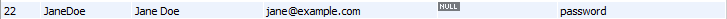

Como vemos el usuario se crea, pero este se crea con ciertos errores, pero esto lo arreglaremos en el siguiente video

## Hashing automático de contraseñas con mutadores / Automatic Password Hashing with mutators

Agregamos lo siguiente en la funcion store() en RegisterController

```php
public function store() {
        $attributes = request()->validate([
            'name' => 'required|max:255',
            'username' => 'required|max:255|min:3',
            'email' => 'required|email|max:255',
            'password' => 'required|min:7|max:255',
        ]);

        $attributes ['password'] = bcrypt($attributes ['password']);
        User::create($attributes);

        return redirect('/');
    }
```

Otra manera de ocultar el password dentro de la base de datos sería con un mutator en el modelo User.php

```php
public function setPasswordAttribute($password) {
    $this->attributes['password'] = bcrypt($password);
}
```

## Validación fallida y datos de entrada antiguos / Failed Validation and Old Input Data

Vamos a crear un mensaje de validacion fallida para el form de registrar en la vista create

```php
@error('name')
    <p class="text-red-500 text-xs mt-1">{{ message }}</p>
@enderror
```

Al salir este error se nos eliminan los campos que si son validos en el formulario, por loq ue agregamos lo siguiente para mantener el texto

```php
value="{{old('name')}}"
```

Esto lo agregamos en todo los campos menos el de la contraseña

Como vemos al no validar los datos nos sale el error y nos mantiene la informacion en el formulario

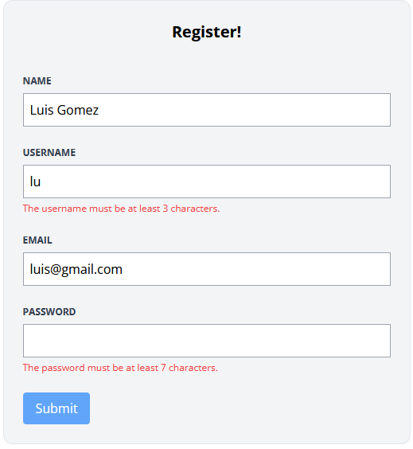

Si queremos ingresar un username o un email que ya se encuentra en la base de datos, el programa detactará un error y dejrá de compilar, por lo que lo que debemos hacer es lo siguiente.

```php
    public function store() {
        $attributes = request()->validate([
            'name' => 'required|max:255',
            'username' => 'required|min:3|max:255|unique:users,username',
            'email' => 'required|email|max:255|unique:users,email',
            'password' => 'required|min:7|max:255',
        ]);
        User::create($attributes);
        return redirect('/');
    }
```


## Mostrar un mensaje flash de éxito / Show a Success Flash Message

Al crear un usuario nuevo la pagina solo nos redirecciona a la home page, po lo que crearemos un nuevo mensaje que nos advierta si el usuario fue creado exitosamente

Nos vamos a RegisterController y creamos lo siguiente

```php
session()->flash('success', 'Your account has been created.')
```

Luego dentro de la vista layout vamos a añadir lo siguiente antes de la ultima etiqueta del body

```php
@if(session()->has('success'))
    <div>
        <p>{{ session('success') }}</p>
    </div>
@endif
```

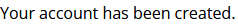

Como podemos ver al final de la pagina se imprime que nuestra cuenta ha sido creada

Al saber qu esto funciona vamos a estilizarlo y añadir un poco de JS para que se cree un mensaje flash

```php
@if(session()->has('success'))
    <div x-data="{ show: true}"
         x-init="setTimeout(() => show = false, 4000)"
         x-show="show"
         class="fixed bg-blue-500 text-white py-2 px-4 rounded-xl bottom-3 right-3 text-sm"
    >
        <p>{{ session('success') }}</p>
    </div>
@endif
```

Nos vamos a llevar este codigo para crear un nuevo componente blade llamado flash

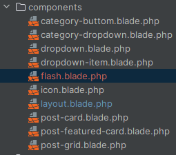

Al final nuestra funcion store() quedará de esta forma

```php
public function store() {
    $attributes = request()->validate([
        'name' => 'required|max:255',
        'username' => 'required|min:3|max:255|unique:users,username',
        'email' => 'required|email|max:255|unique:users,email',
        'password' => 'required|min:7|max:255',
    ]);
    User::create($attributes);

     return redirect('/')->with('success', 'Your account has been created.');;
}
```

## Iniciar y cerrrar sesión / Login and Logout

Antes de iniciar con el login lo que vamos a hacer es crear un botón o algo que podamos clickear para redirigirnos a la pagina de registrar, nos vamos a layout y cambiamos el boton de Home Page por Register

```php
<a href="/register" class="text-xs font-bold uppercase">Register</a>
```

Ahora nos dirigimos a RegisterController para empezar a crear el login

```php
    public function store() {
        $attributes = request()->validate([
            'name' => 'required|max:255',
            'username' => 'required|min:3|max:255|unique:users,username',
            'email' => 'required|email|max:255|unique:users,email',
            'password' => 'required|min:7|max:255',
        ]);
        $user = User::create($attributes);
        auth()->login($user);
        return redirect('/')->with('success', 'Your account has been created.');;
    }
```

Ahora nos vamos al archivo de rutas y editamos

```php
Route::get('register', [RegisterController::Class, 'create'])->middleware('guest');
Route::post('register', [RegisterController::Class, 'store'])->middleware('guest');
```

Para que esto funcione tenemos que editar la ruta en RouteServiceProvider.php de lo contrario nos redigirá a una ruta inexistente

```php
public const HOME = '/';
```

Vamos a layout y agregamos lo siguiente para que el link de register solo se muestre si no estan logueado

```php
@guest
    <a href="/register" class="text-xs font-bold uppercase">Register</a>
@endguest
```

Tambien puede ser de esta manera

```php
@unless
    <a href="/register" class="text-xs font-bold uppercase">Register</a>
@endunless
```

Pero lo vamos a utilizar de esta manera para saber cuando estamos logueados, cabe resaltar que al registrarnos en la pagina esta nos loguea automaticamente.

```php
@auth
    <span class="text-xs font-bold uppercase"> Welcome {{ auth()->user()->name }}! </span>
@else
    <a href="/register" class="text-xs font-bold uppercase">Register</a>
@endauth
```

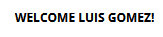

Ahora vamos a crear el boton de logout

```php
@auth
    <span class="text-xs font-bold uppercase"> Welcome {{ auth()->user()->name }}! </span>

    <form method="POST" action="/logout" class="text-xs font-semibold text-blue-500 ml-6">
        <button type="submit">Log Out</button>
    </form>
    @csrf

@else
    <a href="/register" class="text-xs font-bold uppercase">Register</a>
 @endauth
```

Ahora creamos la ruta para que el logout funcione

```php
Route::post('logout', [SessionController::class, 'destroy']);
```

Ahora vamos a la terminal de la VM webserver a crear el nuevo SessionController

```bash
php artisan make:controller SessionController
```

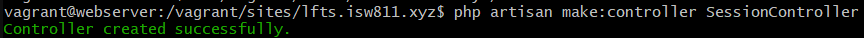

Ahora dentro de este nuevo controller vamos a crear la funcion destroy()

```php
public function destroy() {
    auth()->logout();
    return redirect('/')->with('success', 'Goodbye!');
}
```

Ahora vamos a crear el boton de login

```php
<a href="/login" class="ml-6 text-xs font-bold uppercase">Log In</a>

```

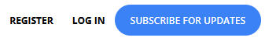

## Construir la pagina de iniciar sesion / Build the Log In Page

Lo primero será crear la ruta en web.php

```php
Route::post('login', [SessionController::class, 'create'])->middleware('guest');
```

Luego de esto le agregamos el middleware a logout para que solo si tienes sesion iniciada puedan acceder

```php
Route::post('logout', [SessionController::class, 'destroy'])->middleware('auth');
```

Ahora nos vamos a SessionController a crear una nueva funcion llamada create()

```php
public function create() {
    return view('sessions.create');
}
```

Y ahora creamos en _resources/view_ creamos un nuevo folder llamado sessions y ahí creamos la vista create

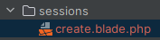

E ingresamos parte del codigo de la vista register

```php
<x-layout>
    <section class="px-6 py-8">
        <main class="max-w-lg mx-auto mt-10 bg-gray-100 border border-gray-200 p-6 rounded-xl"  >
            <h1 class="text-center font-bold text-xl">Log In!</h1>
        </main>
    </section>
</x-layout>
```

Ademas de esto también copiamos parte del codigo del form de register pero eliminamos la parte del username y el name, unicamente necesitamos email y password

Y así se veria la pagina de login

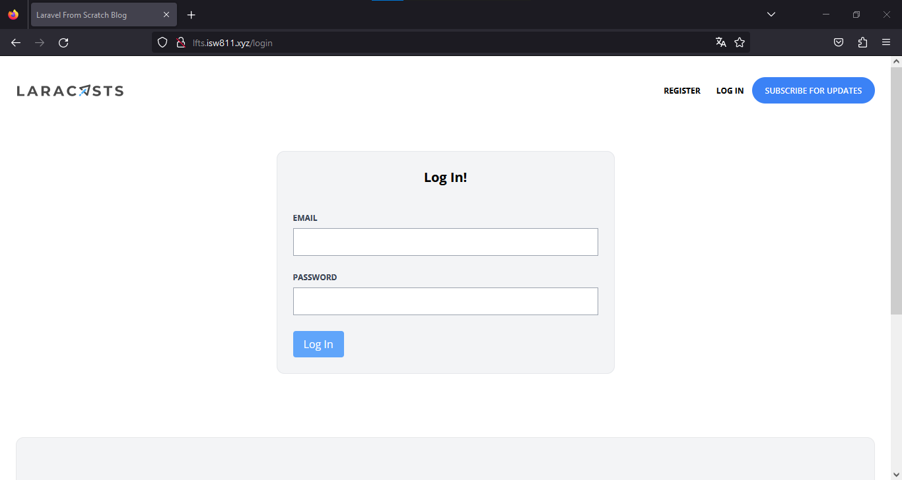

Ahora creamos una ruta a la que enviaremos el post de los datos del login

```php
Route::post('login', [SessionController::class, 'store'])->middleware('guest');
```

Ahora creamos el nuevo metodo store()

```php
    public function store() {
        $attributes = request()->validate([
            'email' => 'required|email',
            'password' => 'required'
        ]);
        if (auth()->attempt($attributes)) {
            return redirect('/')->with('success', 'Welcome Back!');
        }
        return back()
            ->withInput()
            ->withErrors(['email' => 'Your provided credentials could not be verified.']);
    }
```

Otra manera de validar los errores es la siguiente

```php
throw ValidationException::withMessages([
    'email' => 'Your provided credentials could not be verified.'
]);
```

Ahora nos logueamos para verificar que todo funcione

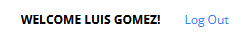

Y vemos como ingresa nuestro nombre en la pagina

Lo ultimo será ingresar esta linea en el if de la funcion store(), esto para regenerar la session del usuario que se está loguando y así evitar ataques

```php
session()->regenerate();
```

## Vistazo rápido de Laravel Breeze / Laravel Breeze Quick Peek

Realizamos unos cambios en la funcions store() en SessionsController

```php
    public function store() {
        $attributes = request()->validate([
            'email' => 'required|email',
            'password' => 'required'
        ]);
        if (! auth()->attempt($attributes)) {
            throw ValidationException::withMessages([
                'email' => 'Your provided credentials could not be verified.'
            ]);
        }
        session()->regenerate();
        return redirect('/')->with('success', 'Welcome Back!');
    }
```

En el video Jeffrey nos enseña como crear un nuevo priyecto con laravel breeze, el cual es un framework de laravel que importa muchas funciones de autenticación, incluyendo inicio de sesión, registro, restablecimiento de contraseña, verificación de correo electrónico y confirmación de contraseña. Además, Breeze incluye una página de "perfil" sencilla donde el usuario puede actualizar su nombre, dirección de correo electrónico y contraseña.

El mismo requiere de la utilizacion de composer y de NodeJS por lo que deben estar instalados en nuestro proyecto para que ste funcione.