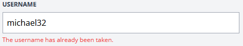

[<--- Volver](/README.md)

# Forms and Authentication

## Construir una pagina de registro de usuarios / Build a Register User Page

Necesitamos una pagina para registrar usuarios en nuestra web, por lo que vamos a crear una nueva ruta en el archivo web.php

```php
Route::get('register', [RegisterController::Class, 'create']);
```

Ahora nos vamos a la terminal de la VM webserver a crear el nuevo controlador por medio de comandos

```php
php artisan make:controller RegisterController
```


En RegisterController creamos la siguiente función

```php
public function create() {
    return view('register.create');
}
```

Y ahora creamos la nueva vista


Como podemos observar al poner _/register_ en la URL de la pagina, esta nos redirige a la vista que creamos.

Luego de crear el formulario en el que vamos a registrar los usuarios, nos movemos al arcihov de rutas ``web.php`` para que el endpoint admita request de tipo POST

```php
Route::post('register', [RegisterController::Class, 'store']);
```

Ahora nos movemos al RegisterController y creamos una nueva funcion()

```php
public function store() {
        $attributes = request()->validate([
            'name' => 'required|max:255',
            'username' => 'required|max:255|min:3',
            'email' => 'required|email|max:255',
            'password' => 'required|min:7|max:255',
        ]);

        User::create($attributes);

        return redirect('/');
    }
```
Ahora vamos a nuestra pagina web a crear un usuario por medio del formulario antes creado


Como vemos el usuario se crea, pero este se crea con ciertos errores, pero esto lo arreglaremos en el siguiente video

## Hashing automático de contraseñas con mutadores / Automatic Password Hashing with mutators

Agregamos lo siguiente en la funcion store() en RegisterController

```php
public function store() {
        $attributes = request()->validate([
            'name' => 'required|max:255',
            'username' => 'required|max:255|min:3',
            'email' => 'required|email|max:255',
            'password' => 'required|min:7|max:255',
        ]);

        $attributes ['password'] = bcrypt($attributes ['password']);
        User::create($attributes);

        return redirect('/');
    }
```

Otra manera de ocultar el password dentro de la base de datos sería con un mutator en el modelo User.php

```php
public function setPasswordAttribute($password) {
    $this->attributes['password'] = bcrypt($password);
}
```

## Validación fallida y datos de entrada antiguos / Failed Validation and Old Input Data

Vamos a crear un mensaje de validacion fallida para el form de registrar en la vista create

```php
@error('name')
    <p class="text-red-500 text-xs mt-1">{{ message }}</p>
@enderror
```

Al salir este error se nos eliminan los campos que si son validos en el formulario, por loq ue agregamos lo siguiente para mantener el texto

```php
value="{{old('name')}}"
```

Esto lo agregamos en todo los campos menos el de la contraseña

Como vemos al no validar los datos nos sale el error y nos mantiene la informacion en el formulario


Si queremos ingresar un username o un email que ya se encuentra en la base de datos, el programa detactará un error y dejrá de compilar, por lo que lo que debemos hacer es lo siguiente.

```php
    public function store() {
        $attributes = request()->validate([
            'name' => 'required|max:255',
            'username' => 'required|min:3|max:255|unique:users,username',
            'email' => 'required|email|max:255|unique:users,email',
            'password' => 'required|min:7|max:255',
        ]);
        User::create($attributes);
        return redirect('/');
    }
```



## Mostrar un mensaje flash de éxito / Show a Success Flash Message

Al crear un usuario nuevo la pagina solo nos redirecciona a la home page, po lo que crearemos un nuevo mensaje que nos advierta si el usuario fue creado exitosamente

Nos vamos a RegisterController y creamos lo siguiente

```php
session()->flash('success', 'Your account has been created.')
```

Luego dentro de la vista layout vamos a añadir lo siguiente antes de la ultima etiqueta del body

```php
@if(session()->has('success'))
    <div>
        <p>{{ session('success') }}</p>
    </div>
@endif
```


Como podemos ver al final de la pagina se imprime que nuestra cuenta ha sido creada

Al saber qu esto funciona vamos a estilizarlo y añadir un poco de JS para que se cree un mensaje flash

```php
@if(session()->has('success'))
    <div x-data="{ show: true}"
         x-init="setTimeout(() => show = false, 4000)"
         x-show="show"
         class="fixed bg-blue-500 text-white py-2 px-4 rounded-xl bottom-3 right-3 text-sm"
    >
        <p>{{ session('success') }}</p>
    </div>
@endif
```

Nos vamos a llevar este codigo para crear un nuevo componente blade llamado flash


Al final nuestra funcion store() quedará de esta forma

```php
public function store() {
    $attributes = request()->validate([
        'name' => 'required|max:255',
        'username' => 'required|min:3|max:255|unique:users,username',
        'email' => 'required|email|max:255|unique:users,email',
        'password' => 'required|min:7|max:255',
    ]);
    User::create($attributes);

     return redirect('/')->with('success', 'Your account has been created.');;
}
```

##

##

##