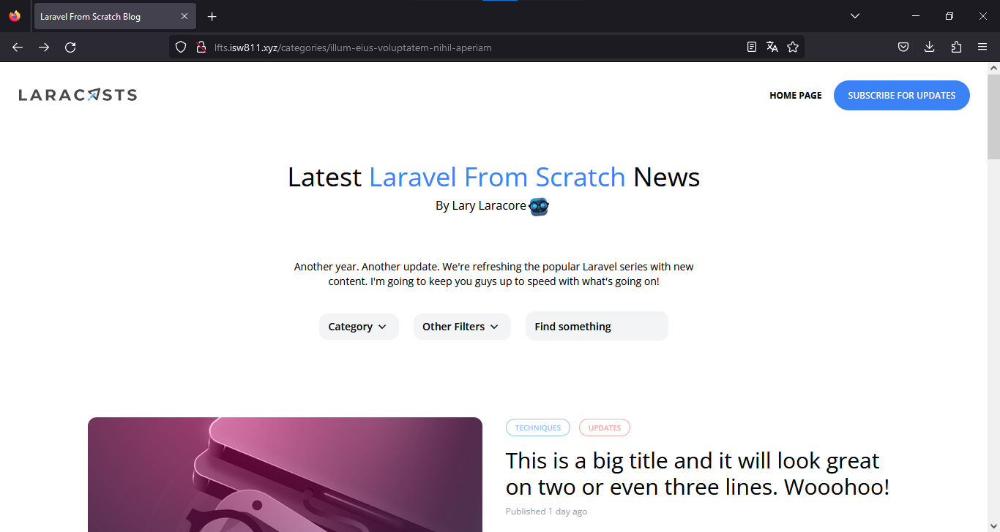
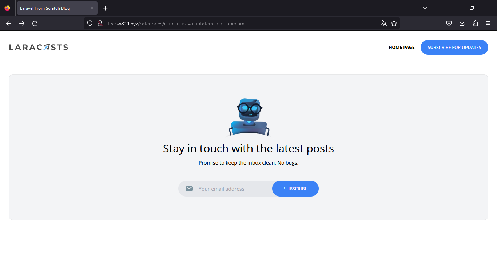

[<--- Volver](/README.md)

# Integrate the design

## Convierta HTML y CSS a Blade / Convert the HTML and CSS to Blade

Primero vamos a descargar un repositorio de GitHub en el que se encuentran recursos que nos serán utiles para el blog

Dentro del folder que descargamos se encuentra un folder llamado images, este lo vamos a copiar dentro de nuestro proyecto en la carpeta _public_

- [Repositorio de los recursos](https://github.com/laracasts/Laravel-From-Scratch-HTML-CSS)

Una vez hecho esto, vamos a abrir el archivo index.htlm con nuestro IDE y copiamos todo el codigo en el archivo layout.blade.php y revisamos que todos los recursos esten con la ruta correcta

Ahora vamos a recargar nuestra web para ver los cambios



Ahora lo que haremos será eliminar todo a exepcion del footer y la nav bar y revisamo la pagina



En medio del nav y el footer agregaremos lo siguiente

```php
{{ $slot }}
```

Creamos un nuevo archivo dentro de layouts

y pegamos lo siguiente

```html
<article
                    class="transition-colors duration-300 hover:bg-gray-100 border border-black border-opacity-0 hover:border-opacity-5 rounded-xl">
                    <div class="py-6 px-5">
                        <div>
                            
                        </div>

                        <div class="mt-8 flex flex-col justify-between">
                            <header>
                                <div class="space-x-2">
                                    <a href="#"
                                       class="px-3 py-1 border border-blue-300 rounded-full text-blue-300 text-xs uppercase font-semibold"
                                       style="font-size: 10px">Techniques</a>
                                    <a href="#"
                                       class="px-3 py-1 border border-red-300 rounded-full text-red-300 text-xs uppercase font-semibold"
                                       style="font-size: 10px">Updates</a>
                                </div>

                                <div class="mt-4">
                                    <h1 class="text-3xl">
                                        This is a big title and it will look great on two or even three lines. Wooohoo!
                                    </h1>

                                    <span class="mt-2 block text-gray-400 text-xs">
                                        Published <time>1 day ago</time>
                                    </span>
                                </div>
                            </header>

                            <div class="text-sm mt-4">
                                <p>
                                    Lorem ipsum dolor sit amet, consectetur adipiscing elit, sed do eiusmod tempor incididunt
                                    ut labore et dolore magna aliqua. Ut enim ad minim veniam, quis nostrud exercitation
                                    ullamco laboris nisi ut aliquip ex ea commodo consequat.
                                </p>

                                <p class="mt-4">
                                    Duis aute irure dolor in reprehenderit in voluptate velit esse cillum dolore eu fugiat nulla pariatur.
                                </p>
                            </div>

                            <footer class="flex justify-between items-center mt-8">
                                <div class="flex items-center text-sm">
                                    
                                    <div class="ml-3">
                                        <h5 class="font-bold">Lary Laracore</h5>
                                        <h6>Mascot at Laracasts</h6>
                                    </div>
                                </div>

                                <div>
                                    <a href="#"
                                       class="transition-colors duration-300 text-xs font-semibold bg-gray-200 hover:bg-gray-300 rounded-full py-2 px-8"
                                    >Read More</a>
                                </div>
                            </footer>
                        </div>
                    </div>
                </article>
```

Ahora tenemos un componente para una carta

En mi caso tuve que crear dentro de reources una carpeta llamada components y poner tanto el layout.blade.php y el post-card.blade-php dentro de esa carpeta para que me funcionara todo como en el video.

Ahora creamos un nuevo componente con le nombre post-featured-card.blade.php que será el post principal dentro de la pagina

Creamos una nueva vista llamada _post-header.blade.php para almacenar el header de la pagina


## Componentes Blade y cuadrículas CSS / Blade Components and CSS Grids

## Convertir la página de publicación del blog / Convert the Blog Post Page

## Un pequeño desvío del menú desplegable de JavaScript / A Small JavaScript Dropdown Detour

## Cómo extraer un componente de hoja desplegable / How to Extract a Dropdown Blade Component

## Tweeks rápidos y limpieza / Quick Tweeks and Clean-Up