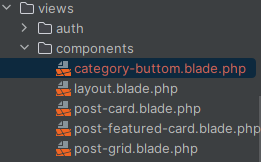
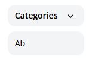

[<--- Volver](/README.md)

# Integrate the design

## Convierta HTML y CSS a Blade / Convert the HTML and CSS to Blade

Primero vamos a descargar un repositorio de GitHub en el que se encuentran recursos que nos serán utiles para el blog

Dentro del folder que descargamos se encuentra un folder llamado images, este lo vamos a copiar dentro de nuestro proyecto en la carpeta _public_

- [Repositorio de los recursos](https://github.com/laracasts/Laravel-From-Scratch-HTML-CSS)

Una vez hecho esto, vamos a abrir el archivo index.htlm con nuestro IDE y copiamos todo el codigo en el archivo layout.blade.php y revisamos que todos los recursos esten con la ruta correcta

Ahora vamos a recargar nuestra web para ver los cambios


Ahora lo que haremos será eliminar todo a exepcion del footer y la nav bar y revisamo la pagina


En medio del nav y el footer agregaremos lo siguiente

```php
{{ $slot }}
```

Creamos un nuevo archivo dentro de layouts

y pegamos lo siguiente

```html
<article
                    class="transition-colors duration-300 hover:bg-gray-100 border border-black border-opacity-0 hover:border-opacity-5 rounded-xl">
                    <div class="py-6 px-5">
                        <div>
                            
                        </div>

                        <div class="mt-8 flex flex-col justify-between">
                            <header>
                                <div class="space-x-2">
                                    <a href="#"
                                       class="px-3 py-1 border border-blue-300 rounded-full text-blue-300 text-xs uppercase font-semibold"
                                       style="font-size: 10px">Techniques</a>
                                    <a href="#"
                                       class="px-3 py-1 border border-red-300 rounded-full text-red-300 text-xs uppercase font-semibold"
                                       style="font-size: 10px">Updates</a>
                                </div>

                                <div class="mt-4">
                                    <h1 class="text-3xl">
                                        This is a big title and it will look great on two or even three lines. Wooohoo!
                                    </h1>

                                    <span class="mt-2 block text-gray-400 text-xs">
                                        Published <time>1 day ago</time>
                                    </span>
                                </div>
                            </header>

                            <div class="text-sm mt-4">
                                <p>
                                    Lorem ipsum dolor sit amet, consectetur adipiscing elit, sed do eiusmod tempor incididunt
                                    ut labore et dolore magna aliqua. Ut enim ad minim veniam, quis nostrud exercitation
                                    ullamco laboris nisi ut aliquip ex ea commodo consequat.
                                </p>

                                <p class="mt-4">
                                    Duis aute irure dolor in reprehenderit in voluptate velit esse cillum dolore eu fugiat nulla pariatur.
                                </p>
                            </div>

                            <footer class="flex justify-between items-center mt-8">
                                <div class="flex items-center text-sm">
                                    
                                    <div class="ml-3">
                                        <h5 class="font-bold">Lary Laracore</h5>
                                        <h6>Mascot at Laracasts</h6>
                                    </div>
                                </div>

                                <div>
                                    <a href="#"
                                       class="transition-colors duration-300 text-xs font-semibold bg-gray-200 hover:bg-gray-300 rounded-full py-2 px-8"
                                    >Read More</a>
                                </div>
                            </footer>
                        </div>
                    </div>
                </article>
```

Ahora tenemos un componente para una carta

En mi caso tuve que crear dentro de reources una carpeta llamada components y poner tanto el layout.blade.php y el post-card.blade-php dentro de esa carpeta para que me funcionara todo como en el video.

Ahora creamos un nuevo componente con le nombre post-featured-card.blade.php que será el post principal dentro de la pagina

Creamos una nueva vista llamada _post-header.blade.php para almacenar el header de la pagina

para incluir el header dentro de posts-blade-php utilizamos

```php
@include ('_post-header')
```

Asi tendriamos el codigo mucho mejor organizado

## Componentes Blade y cuadrículas CSS / Blade Components and CSS Grids

Ahora vamos a modificar el componente post-featured-card para que sea dinamico

En el archivo posts vamos a añadirle lo siguiente a la etiqueta de la card que queremos hacer dinamica

```php
<x-post-featured-card :post="$posts[0]"/> //Esto para que el principal siempre sea el ultimo post guardado
```

Luego en el archivo post-featured-card agregemos esto al principio del archivo para que acepte props

```php
@props(['post'])
```
El codigo de post-featured-card quedaría asi

```php
@props(['post'])

<article
    class="transition-colors duration-300 hover:bg-gray-100 border border-black border-opacity-0 hover:border-opacity-5 rounded-xl">
    <div class="py-6 px-5 lg:flex">
        <div class="flex-1 lg:mr-8">
            
        </div>

        <div class="flex-1 flex flex-col justify-between">
            <header class="mt-8 lg:mt-0">
                <div class="space-x-2">
                    <a href="/categories/{{ $post->category->slug }}"
                       class="px-3 py-1 border border-blue-300 rounded-full text-blue-300 text-xs uppercase font-semibold"
                       style="font-size: 10px">{{ $post->category->name }}</a>
                </div>

                <div class="mt-4">
                    <h1 class="text-3xl">
                        <a href="/posts/{{$post->slug}}"></a>
                        {{$post->title}}
                    </h1>

                    <span class="mt-2 block text-gray-400 text-xs">
                        Published <time>{{ $post->created_at->diffForHumans()  }}</time>
                    </span>
                </div>
            </header>

            <div class="text-sm mt-2">
                <p>
                    {{ $post->excerpt }}
                </p>
            </div>

            <footer class="flex justify-between items-center mt-8">
                <div class="flex items-center text-sm">
                    
                    <div class="ml-3">
                        <h5 class="font-bold">{{ $post->author->name }}</h5>
                        <h6>Mascot at Laracasts</h6>
                    </div>
                </div>

                <div class="hidden lg:block">
                    <a href="/posts{{$post->slug}}"
                       class="transition-colors duration-300 text-xs font-semibold bg-gray-200 hover:bg-gray-300 rounded-full py-2 px-8"
                    >Read More</a>
                </div>
            </footer>
        </div>
    </div>
</article>
```

Luego de haber cambiado el codigo de post-featured-card para que sea dinamico revisamo la web


Como vemos la información logra cargarse de manera correcta

El codigo en posts.blade.php para cargar todos los demás posts seria este
```php
<div class="lg:grid lg:grid-cols-2">
            @foreach($posts->skip(1) as $post)
                <x-post-card :post="$post"/>
            @endforeach
        </div>
```

Ahora vamos a trabajar en que post-card sea dinamico, lo haremos en base a como lo hicimos en post-featured-card

Cambiamos el codigo de posts.blade.php para evitar errores en la web en caso de no existir ningún post

Ahora así quedaría el codigo de posts para que se cargue el primer posts, luego haya una vista de dos posts y luego lo demas se carguen en vistas de 3

```php
<x-layout>

    @include ('_posts-header')

    <main class="max-w-6xl mx-auto mt-6 lg:mt-20 space-y-6">

        @if($posts->count())
            <x-post-featured-card :post="$posts[0]"/>

            @if($posts->count() > 1)
                <div class="lg:grid lg:grid-cols-6">

                    @foreach($posts->skip(1) as $post)

                        <x-post-card
                            :post="$post"
                            class="{{ $loop->iteration < 3 ? 'col-span-3' : 'col-span-2'}}"
                        />
                    @endforeach
                </div>
            @endif
        @else
            <p class="text-center">No posts yet. Please check back later</p>
        @endif
    </main>
</x-layout>
```

Para ordenar de mejor manera el comigo vamos a crear un nuevo componente llamado post-grid.blade.php

Este sería su codigo

```php
@props('post')

<x-post-featured-card :post="$posts[0]"/>

@if($posts->count() > 1)

    <div class="lg:grid lg:grid-cols-6">

        @foreach($posts->skip(1) as $post)

            <x-post-card
                :post="$post"
                class="{{ $loop->iteration < 3 ? 'col-span-3' : 'col-span-2'}}"
            />

        @endforeach

    </div>

@endif
```

Y al final posts os quedaría de esta manerea

```php
<x-layout>

    @include ('_posts-header')

    <main class="max-w-6xl mx-auto mt-6 lg:mt-20 space-y-6">

        @if($posts->count())
            <x-post-grid :posts="$posts" />
        @else
            <p class="text-center">No posts yet. Please check back later</p>
        @endif
    </main>
</x-layout>
```

## Convertir la página de publicación del blog / Convert the Blog Post Page

Vamos a copiar el HTML del archivo posts que esta en el mismo repositorio que el anterior, vamos a pegar este codigo en post.blade.php y vamos a modificarlo para volverlo dinamico.

Creamos un nuevo componente llamado `category-buttom.blade.php` el cual se encargará de la información de las categorías


Y ahora con los cambios en los componentes y en la vista de post podemos visualizar como nuestro post se vuelve dinamico


## Un pequeño desvío del menú desplegable de JavaScript / A Small JavaScript Dropdown Detour

Copiamos la siguiente linea de codigo dentro de nuestro archivo layout

```html
<script src="https://cdn.jsdelivr.net/gh/alpinejs/alpine@v2.x.x/dist/alpine.min.js" defer></script>
```

Luego de modificar el archivo _post-headers vamos a la web y vemos como se cargar dinamicamente las categorias



Ahora para poder ingresar a los posts desde el menu de categorías agregamos esto en la ruta en web.php

```php
Route::get('/', function () {

   return view('posts', [
        'posts' => Post::latest()->get(),
       'categories' => Category::all()

    ]);
});

Route::get('posts/{post}', function (Post $post) {

    return view('post', [
        'post' => $post
    ]);
});

Route::get('categories/{category:slug}', function (Category $category) {

    return view('posts', [
        'posts' => $category->posts,
        'currentCategory' => $category,
        'categories' => Category::all()
    ]);
});

Route::get('authors/{author:username}', function (User $author) {

    return view('posts', [
        'posts' => $author->posts,
        'categories' => Category::all()
    ]);
});
```

## Cómo extraer un componente de hoja desplegable / How to Extract a Dropdown Blade Component

Creamos un nuevo componente llamado dropdown.blade.php para guardar todo el codigo para el menu despleglegable que hicimos el video anterior


El codigo es el siguiente 

```php
@props(['trigger'])

<div x-data="{show: false}" @click.away="show = false">
    {{-- Triggers --}}
    
    <div @click="show = ! show">
        {{ $trigger }}
    </div>

    {{-- Links --}}
    <div x-show="show" class="py-2 absolute bg-gray-100 mt-2 rounded-xl w-full z-50" style="display: none">
        {{ $slot }}
    </div>
</div>
```

Creamos un nuevo componente llamado dropdown-item.blade.php para guardar css del menú desplegable


Agregamos el siguiente codigo al archivo web.php para darle nombre a la ruta

```php
Route::get('/', function () {

   return view('posts', [
        'posts' => Post::latest()->get(),
       'categories' => Category::all()

    ]);
})->name('home');
```

Esto para que el siguiente codigo del menu desplegable marque en que parte del menu se encuentra la pagina

```php
<x-dropdown-item href="/" :active="request()->routeIs('home')">All </x-dropdown-item>
```

Agregamos un nuevo componente llamado `down-arrow.blade.php`


Este tendar el codigo de la flecha del menu desplegable

```php
<svg {{ $attributes (['class' => 'transform -rotate-90']) }} width="22" height="22" viewBox="0 0 22 22">
    <g fill="none" fill-rule="evenodd">
        <path stroke="#000" stroke-opacity=".012" stroke-width=".5" d="M21 1v20.16H.84V1z">
        </path>
        <path fill="#222"
              d="M13.854 7.224l-3.847 3.856 3.847 3.856-1.184 1.184-5.04-5.04 5.04-5.04z"></path>
    </g>
</svg>
```

Ahora otra forma de hacerlo es renombrar el archivo down-arrow a icon y por medio de props pasar el nombre

```php
@props(['name'])

@if($name == 'down-arrow')
    <svg {{ $attributes (['class' => 'transform -rotate-90']) }}  width="22" height="22" viewBox="0 0 22 22">
        <g fill="none" fill-rule="evenodd">
            <path stroke="#000" stroke-opacity=".012" stroke-width=".5" d="M21 1v20.16H.84V1z">
            </path>
            <path fill="#222"
                  d="M13.854 7.224l-3.847 3.856 3.847 3.856-1.184 1.184-5.04-5.04 5.04-5.04z"></path>
        </g>
    </svg>
@endif
```

Esta sería la manera de llamar a este componente

```php
<x-icon name="down-arrow" class="absolute pointer-events-none" style="right: 12px;" />
```

## Tweeks rápidos y limpieza / Quick Tweeks and Clean-Up

Agregamos ciertos cambios pequeños en el css de varios archivos para que la pagina se vea mucho mas limpia, nada fuera de lo normal.