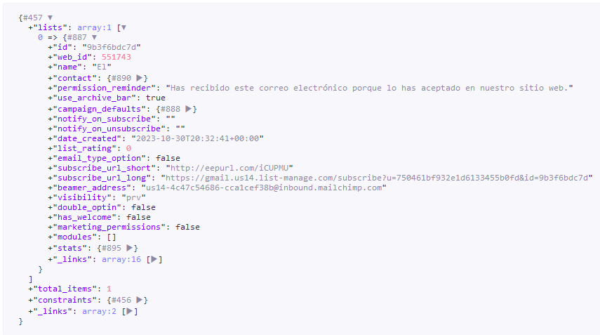

[<--- Volver](/README.md)

# Newspaper and APIs

## Modificación de la API de Mailchimp / Mailchimp API Tinkering

Ahora vamos a agregar funcionalidad a la parte baja de nuestra pagina web, en concreto esta


En el componente `layout` vamos a editar la referencia

```php
<a href="#newletter" class="bg-blue-500 ml-3 rounded-full text-xs font-semibold text-white uppercase py-3 px-5">
    Subscribe for Updates
</a>
```

Posterior a esto lo que haremos sera ir a la pagina de maolchip, para consumir la API que necesitamos para poder enviar los mensajes por medio del correo
- [Pagina oficial de Mailchip](https://mailchimp.com/es/)

Aca lo que haremos sera darle al boton que dice `Sign In` o `Registrate` para registarnos en la pagina y poder utilizar la API.

Al darle al boton nos saldra la opcion de suscribirnos en varios planes, en este caso utilizamos el plan gratis.

Una vez dentro de la pagina luego de habernos registrado y completado el correspondiente formulario, vamos a nuestra cuenta para crear una API key


Nos vamos a cuenta y facturacion


Y una vez aca nos dirigimos hacia la parte de extras, y al apartado de claves API 


Escroleamos un poco hasta toparnos con esta parte y damos click deonde dice `crear una clave`


Una vez creada la clave, la copiamos y la llevamos a nuestro .env para guardarla

```php
MAILCHIMP_KEY=YOURAPIKEYHERE
```

Luego nos vfamos a la ruta _config_ y nos dirigimos al archivo `services.php`, aca lo que haremos sera crear el nuevo servicio que vamos a annadir a nuestro proyecto.

```php
'mailchimp' => [
    'key' => env('MAILCHIMP_KEY')
]
```

Ahora vamos a la terminal de nuestra VM webserver para verificar que el programa reconozca el servicio

```bash
php artisan tinker
config('services.mailchimp')
```
Nos dirigimos a la pagina de documentacion de la API para que sea mucho mas facil seguir los pasos para contruir la llamada de la API

-[Documentacion de la API Mailchimp](https://mailchimp.com/developer/marketing/guides/quick-start/)

Igulamente dentro de nuestra terminal vamos a instalar la libreria para poder utilizar la API, esto con el siguiente comando

```bash
composer require mailchimp/marketing
```


Ahora copiamos el codigo de la API call en nuestro archivo de rutasm esto sera temporal

```php
Route::get('ping', function () {
    $mailchimp = new \MailchimpMarketing\ApiClient();

    $mailchimp->setConfig([
        'apiKey' => 'YOUR_API_KEY',
        'server' => 'YOUR_SERVER_PREFIX'
    ]);

    $response = $mailchimp->ping->get();
    ddd($response);
});
```

Aca colocamos la API key y ademasd de eso nos pide el server Prrfix, ese lo conseguimos viendop la URL que tenemos al entrar en nuestra cuenta en mailchimp, en mi caso es `us14`


Si al entrar al endpoint de /ping y nos sale esto, significa que todo esta perfectamente configurado y ya podemos hacer uso de la API


Ahora cambiamos esta liean en el response para obtener un array con los datos

```php
$response = $mailchimp->lists->getAllLists();
```

Y recibiremos esto



Ahora al realizar un hardcoding con los datos de mi usuario, nos estariamos subscribiendo para recibir correos

```php
$response = $mailchimp->lists->addListMember('9b3f6bdc7d', [
    'email_address' => 'luis@gmail.com',
    'status' => 'suscribed'
]);
```

## Hacer que el formulario del periodico funcione / Make the Newsletter Form Work

Ahora vamos a hacer que el formulario de envio de correos funcione dinamicamente, para esto modificamos el endpoint en `web.php`

```php
Route::get('newsletter', function () {
    $mailchimp = new \MailchimpMarketing\ApiClient();

    $mailchimp->setConfig([
        'apiKey' => config('services.mailchimp.key'),
        'server' => 'us14'
    ]);

    try {
        $response = $mailchimp->lists->addListMember('9b3f6bdc7d', [
            'email_address' => request('email'),
            'status' => 'suscribed'
        ]);
    }
    catch (\Exception $e) {
        throw \Illuminate\Validation\ValidationException::withMessages([
           'email' => 'This email could not be added to our newsletter list'
        ]);
    }

    return redirect('/')->with('success', 'You are now signed op for our newsletter');
});
```

Luego editamos en layout para que el post sea redigido a la ruta que necesitamos, aproximadamente esta en la linea 64 del codigo y la linea seria esta

```php
<form method="POST" action="/newsletter" class="lg:flex text-sm">
```
El formulario no acepta cualquier email, por loq ue agregamos al codigo de arriba un try catch para enviar un mensaje en caso que el email no funcione, en este caso lo voy a probar con un email invalido para verificar si funciona


## Extraer el servicio de peridico / Extract a Newsletter Service

Creamos un nuevo folder que llamaremos services, en el que creamos una calse llamada Newsletter, en la cual pondremos todo el servicio del Newsletter


Y annadimos la siguiente funcion

```php
public function subscribe(string $email) {
        $mailchimp = new \MailchimpMarketing\ApiClient();

        $mailchimp->setConfig([
            'apiKey' => config('services.mailchimp.key'),
            'server' => 'us14'
        ]);

        return @$mailchimp->lists->addListMember('9b3f6bdc7d', [
            'email_address' => request('email'),
            'status' => 'suscribed'
        ]);
    }
```

El endpoint quedaria de esta manera

```php
Route::post('newsletter', function () {
    request()->validate(['email'=>'required|email']);

    try {
        (new Newsletter())->subscribe(request('email'));
    }
    catch (\Exception $e) {
        throw ValidationException::withMessages([
           'email' => 'This email could not be added to our newsletter list'
        ]);
    }
    return redirect('/')->with('success', 'You are now signed op for our newsletter');
});
```

Nos vamos al archivo services.php que esta en la ruta config y ahi editamos

```php
'mailchimp' => [
    'key' => env('MAILCHIMP_KEY'),
    'lists' => [
        'subscribers' => env('MAILCHIMP_LISTS_SUBSCRIBERS')
    ]
]
```

Asi quedaria la clase de Newsletter

```php
public function subscribe(string $email, string $list = null) {
    $list ??= config('services.mailchimp.lists.subscribers');
    return $this->client()->lists->addListMember($list, [
        'email_address' => request('email'),
        'status' => 'suscribed'
    ]);
}
public function client() {
    $mailchimp = new \MailchimpMarketing\ApiClient();
    $mailchimp->setConfig([
        'apiKey' => config('services.mailchimp.key'),
        'server' => 'us14'
    ]);
}
```

Y asi quedaria el endpoint

```php
Route::post('newsletter', NewsletterController::class);
```

Nos vamos a la consola de la VM webserver a crar el nuevo controller

```bash
php artisan make:controller NewsletterController
```

Asi quedaria el codigo en el nuevo controller 

```php
public function __invoke(Newsletter $newsletter)
    {
        request()->validate(['email' => 'required|email']);

        try {
            $newsletter->subscribe(request('email'));
        } catch (Exception $e) {
            throw ValidationException::withMessages([
                'email' => 'This email could not be added to our newsletter list.'
            ]);
        }

        return redirect('/')
            ->with('success', 'You are now signed up for our newsletter!');
    }
```