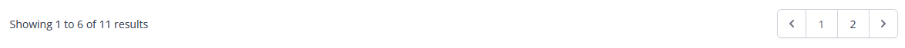
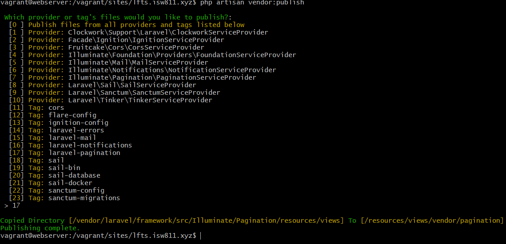
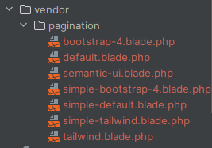

[<--- Volver](/README.md)

# Pagination

## Paginación ridículamente simple / Laughably Simple Pagination

Vamos a hacer que los posts no se carguen en una sola pagina, si no que haremos una paginación para que los posts se carguen en diferentes paginas, las paginas contendrán 6 posts, por lo que emoezamos modificando la funcion index() en PostController

```php
public function index() {
    return view('posts.index', [
        'posts' => Post::latest()->filter(
            request(['search', 'category', 'author'])
    )->paginate(6)
    ]);
}
```

Con esto unicamente se cargarán los 6 posts mas recientes guardados en la base de datos

Ahora nos movemos a la vista index y agregamos lo siguiente

```php
<x-layout>

    @include ('posts._header')

    <main class="max-w-6xl mx-auto mt-6 lg:mt-20 space-y-6">

        @if($posts->count())
            <x-post-grid :posts="$posts"/>

            {{ $posts->links() }}
        @else
            <p class="text-center">No posts yet. Please check back later</p>
        @endif
    </main>
</x-layout>
```

Ahora nos vamos a la pagina a ver el cambio



Ahora nos movemos a la vista category-dropdown y modificamos lo siguiente

```php
<x-dropdown-item href="/?{{ http_build_query(request()->except('category', 'page')) }}"
                     :active="request()->routeIs('home')">All </x-dropdown-item>

    @foreach($categories as $category)

        <x-dropdown-item
            href="/?category={{ $category->slug }}&{{ http_build_query(request()->except('category', 'page')) }}"
            :active="request()->is('categories/' . $category->slug)"
        >{{ ucwords($category->name) }}
        </x-dropdown-item>
```

Esto lo modificamos para que al filtrar no lo haga solo en la pagina en la que se encuentra si no qu elo haga con todos los posts

Nos vamos a nuestra terminal en la VM y corremos el comando 

```bash
php artisan vendor:publish
```



Con esto lo que hicimos fue copiar todas las viatas de paginación a la ruta _resources/views/vendor_



Si en PostController cambiamos paginate() por simplePaginate() en la web veremos este cambio

```php
 public function index() {
    return view('posts.index', [
        'posts' => Post::latest()->filter(
                request(['search', 'category', 'author'])
        )->simplePaginate(6)
    ]);
}
```


Ahora iremos a la terminal de la VM y correremos el siguiente comando para agregar 10 posts que tengan la misma categoría, esto para que exista mas de una página de la misma categoría

```bash
php artisan tinker
App\Models\Post::factory(10)->create(['category_id' => 2]);
```

Al clickear en en botón next se borra el filtro de la categoría, para arreglarlo modificamos lo siguiente en PostController

```php
 public function index() {
    return view('posts.index', [
        'posts' => Post::latest()->filter(
                request(['search', 'category', 'author'])
        )->simplePaginate(6)->withQueryString()
    ]);
}
```

Ahora como podemos observar en el query string se quedan los filtros al cambiar entre paginas

