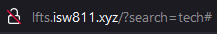

[<--- Volver](/README.md)

# Search

## Búsqueda (de forma desordenada) / Search (The Messy Way)

Vamos a habilitar la busqueda de post de una manera un poco fea

Lo primero será ir al archivo _post-header.blade.php y centranos en esta parte

```php
<div class="relative flex lg:inline-flex items-center bg-gray-100 rounded-xl px-3 py-2">
        <form method="GET" action="#">
            <input type="text" name="search" placeholder="Find something"
                    class="bg-transparent placeholder-black font-semibold text-sm">
        </form>
    </div>
```

Esta parte del código lo que hace es buscar por medio de la URL



Para que esto funcione iremos al archivo de ruta `web.php` y agregamos lo siguiente en la ruta principal

```php
Route::get('/', function () {

    $posts = Post::latest();

    if (request('search')) {
        $posts->where('title', 'like', '%' . request('search') . '%');
    }
   return view('posts', [
        'posts' => $posts->get(),
       'categories' => Category::all()
    ]);
})->name('home');
```


Como se puede visualizar la busqueda por palabras ya funciona, sin embargo no es la manera mas limpia de hacerlo.

También se puede buscar de manera que en el cuerpo del post también se encuentre la palabra buscada, esto se hace modificando un poco el código anterior


```php
Route::get('/', function () {

    $posts = Post::latest();

    if (request('search')) {
        $posts->where('title', 'like', '%' . request('search') . '%')
        ->orWhere('body', 'like', '%' . request('search') . '%');
    }
   return view('posts', [
        'posts' => $posts->get(),
       'categories' => Category::all()
    ]);
})->name('home');
```

Ahora vamos a agregar esta pequeña linea en el input de buscar para que quede escrito la plabra que buscamos a la hora de buscar los post

```php
value="{{ request('search) }}"
```

## Búsqueda (de forma más limpia) / Search (The Cleaner Way)

Para crear las busquedas de la manera mas limpia, vamos a comenzar creando un controller con le nombre `PostController`, para esto nos vamos a la VM webserver y en la ruta de nuestro proyecto corremos el siguiente comando

```bash
php artisan make:controller PostController
```


Esto nos creara un archivo o clase PostController


Ahora toda la logica que pusimos en el archivo de rutas web.php lo vamos a mover al PostController y el codigo quedaría así

```php
class PostController extends Controller
{
    public function index() {

        $posts = Post::latest();

        if (request('search')) {
            $posts->where('title', 'like', '%' . request('search') . '%')
                ->orWhere('body', 'like', '%' . request('search') . '%');
        }
        return view('posts', [
            'posts' => $posts->get(),
            'categories' => Category::all()
        ]);
    }
}
```

Y ahora el código de la ruta quedaría de esta manera

```php
Route::get('/', [PostController::class, 'index'])->name('home');
```

Agregamos otra funcion al PostController la cua se encargará de cargar los Post

```php
public function show(Post $post) {
    return view('post', [
        'post' => $post
    ]);
}
```

Y ahora el código de la ruta que se encarga de mostrar los post quedaría de esta manera

```php
Route::get('posts/{post}', [PostController::class, 'show']);
```

Creamos una nueva función dentro de PostController que se encargará de obtener los post

```php
protected function getPost()
{
    return Post::latest()->filter()->get();
}
```

Y la función de index quedaría de esta manera

```php
public function index() {
    return view('posts', [
        'posts' => $this->getPost(),
        'categories' => Category::all()
    ]);
}
```

Ahora iremos a la clase Post a crear la funcion filter()

```php
public function scopeFilter($query) {
    if (request('search')) {
        $query
           ->where('title', 'like', '%' . request('search') . '%')
          ->orWhere('body', 'like', '%' . request('search') . '%');
    }
}
```


Esto podría volverse aun mas limpio si hacemos lo siguiente en Post Controller, eliminamos la funcion getPost y desde la función index llamamos el filtro que se encuentra en la clase Post

```php
public function index() {
    return view('posts', [
        'posts' => Post::latest()->filter()->get(),
        'categories' => Category::all()
     ]);
}
```

Realizamos cambios en el filtro en la clase Post

```php
public function scopeFilter($query, array $filters) {
    if ($filters['search'] ?? false) {
        $query->where('title', 'like', '%' . request('search') . '%')
              ->orWhere('body', 'like', '%' . request('search') . '%');
    }
}
```

Volvemos a PostController y modificamos para que lso cambios en la clase Post funcionen

```php
public function index() {

    return view('posts', [
        'posts' => Post::latest()->filter(request(['search']))->get(),
        'categories' => Category::all()
    ]);
}
```

Otra variante para este metodo sería la siguiente

```php
public function scopeFilter($query, array $filters) {
    $query->when($filters['search'] ?? false, fn($query, $search)=>
        $query->where('title', 'like', '%' . $search . '%')
              ->orWhere('body', 'like', '%' . $search . '%'));
}
```