[<--- Volver](/README.md)

# The Basics

## Como una ruta carga una vista / How a route load a view

En el directorio de nuestro proyecto hay varias carpertas, para el tema de rutas nos interesan estas dos es particular `routes` y `resources/views`

En la primer carpeta la cual se llama `routes` podemos encontrar los siguientes archivos, el que nos interesa es el el llamado `web.php` ya que ese archivo es el que maneja las rutas de nustra pagina web.

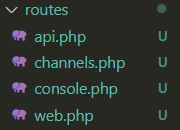

En este archivo podemos encontrar el siguiente codigo que es el encargado de cargar la informacion que se despliega en la pagina principal de nuestra web.

```php
 
```

En el return de la función podemos ver un archivo llamado `'welcome'`, ese archivo es el que contiene todo el html que se despliega en la pagina de inicio
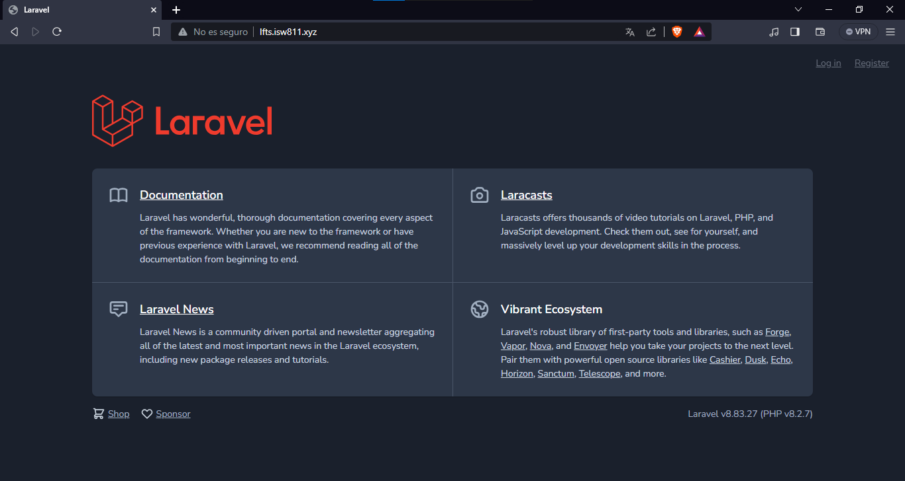

Ese archivo es importado desde la carpeta `resources/views` y el archivo que contiene todo el html para desplegar el contenido de la pagina se llama `welcome.blade.php` solo que al colocarlo en la funcion solo hace falta poner el primer nombre antes del primer punto.

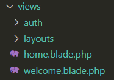

Cualquier cambio producido en el archivo `welcome.blade.php` se verá reflejado en `web.php` al momento de cargar la pagina.

De igual manera, un cambio producido en el return de la función comentada lineas arriba, se vera reflejado en la pagina de incio al cargar la pagina web. Por ejemplo: cambiamos el archivo `'welcome'` por el archivo `'home'`

```php
Route::get('/', function () {
    return view('home');
});

Auth::routes();

Route::get('/home', [App\Http\Controllers\HomeController::class, 'index'])->name('home');

```

Ahora podemos visualizar que en nuestra main page lo que se carga es la pagina `home` en lugar de la página `welcome`

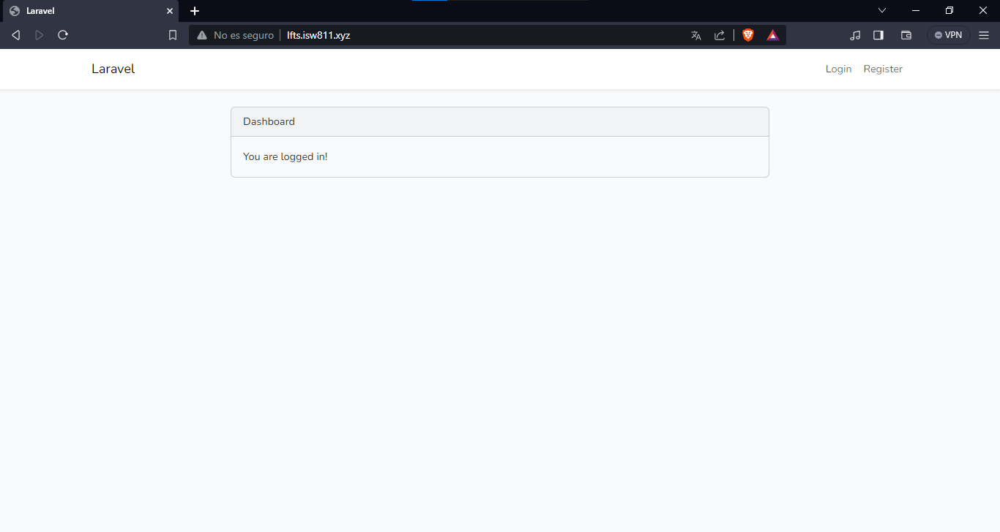

## Incluir CSS y JavaScript / Include CSS and JavaScript

Este es el segundo video del modelo The Basics en el que vamos a incluir CSS y JavaScript basicos a una vista de nuestra pagina web.

Para empezar vamos a cambiar el contenido del archivo `welcome.blade.php` por este codigo basico

```html
<!DOCTYPE html>
<html lang="en">
<head>
    <meta charset="UTF-8">
    <meta name="viewport" content="width=device-width, initial-scale=1.0">
    <title>My Blog</title>
</head>
<body>
    <h1>Hello World</h1>
</body>
</html>
```

Y asi se veria nuestro sitio web con los cambios en el codigo

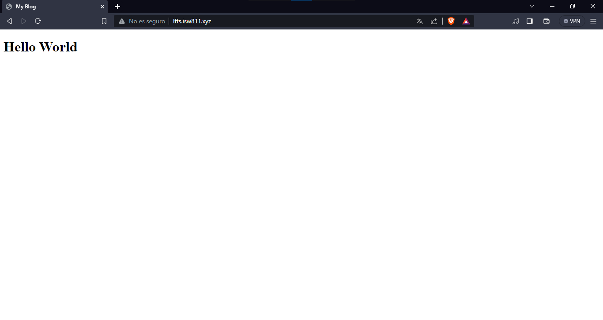

En la carpeta de `resources` podemos encontrar dos carpetas llamadas `css` y `js` pero de momento vamos a ignorarlas.

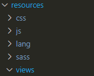

Nos vamos a concentrar en la carpeta `public` ya que dentro de esta en una carpeta llamada `css` tenemos un archivo css que es el que vamos a manipular para cambiar el diseño de la web.

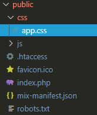

En el respectivo archivo css agregamos este epqueño codigo

```css
body {
    background: navy;
    color: white
}
```

Luego nos movemos a nuestro archivo `welcome` y linkeamos el archivo app.css para poder visualizar los cambios en el diseño de la pagina

```html
<!DOCTYPE html>
<html lang="en">
<head>
    <meta charset="UTF-8">
    <meta name="viewport" content="width=device-width, initial-scale=1.0">
    <link rel="stylesheet" href="./css/app.css">
    <title>My Blog</title>
</head>
<body>
    <h1>Hello World</h1>
</body>
</html>
```

Y podemos visualizar como cambia nuestra web 

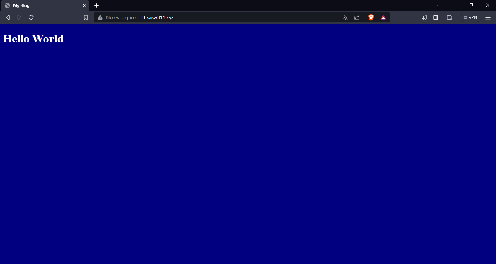

Para añadir JavaScript es el mismo proceso, solamente cambiando la carpeta `css` por la llamada `js` y el archivo `app.css` por el archivo `app.js`

En `app.js` añadimos el siguiente codigo 

```js
alert('I am here');
```

Linkeamos nuestro archivo js con el archivo welcome.

```html
<!DOCTYPE html>
<html lang="en">
<head>
    <meta charset="UTF-8">
    <meta name="viewport" content="width=device-width, initial-scale=1.0">
    <link rel="stylesheet" href="./css/app.css">
    <title>My Blog</title>
</head>
<body>
    <h1>Hello World</h1>
</body>
<script src="./js/app.js"></script>
</html>
```

Y ahora al entrar en la web se desplegaria la alerta

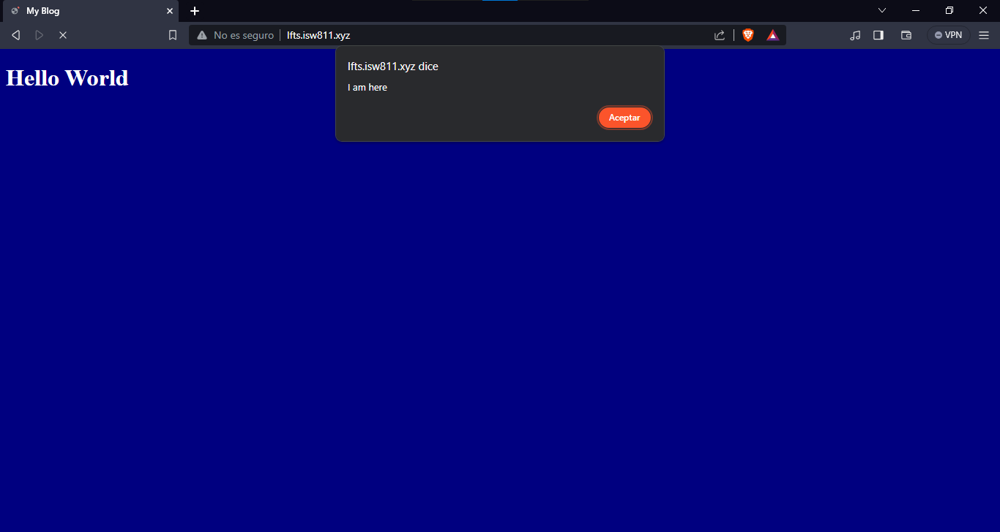

## Haz una ruta y vincúlala / Make a route and link it

Nos dirigimos al archivo `web.php` vamos a cambiar lo que retorna la funcion, por lo que vamos a cambiar la palabra welcome por posts.

```php
Route::get('/', function () {
    return view('posts');
});

Auth::routes();

Route::get('/home', [App\Http\Controllers\HomeController::class, 'index'])->name('home');
```

Observamos que al ingresar a la pagina esta nos dice que no reconoce la vista de `posts`.

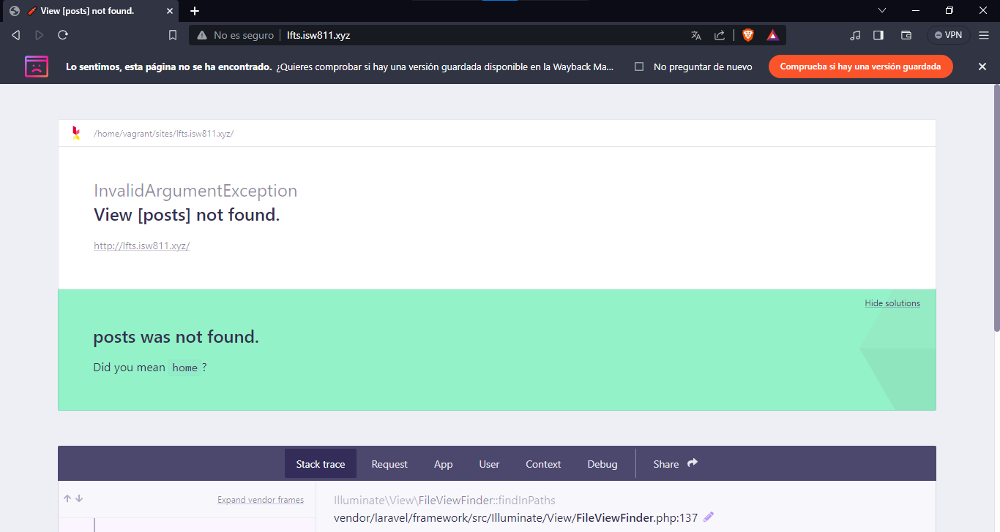

Lo que vamos a hacer es renombrar la pagina `welcome` y le daremos el nombre `posts`

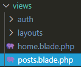

Ahora recargamos la pagina y vemos como si renococe el archivo `posts`

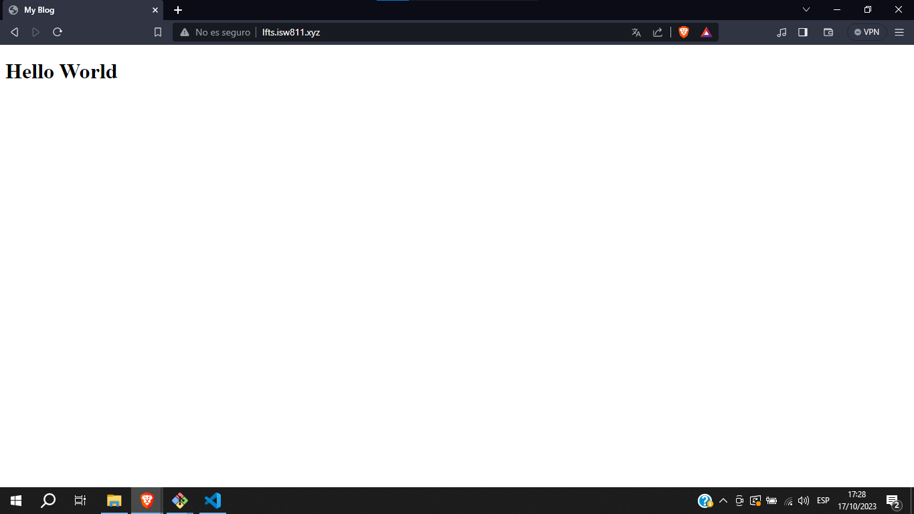

Lo siguiente que haremos sera cambiar el archivo `app.css` para tener un fondo blanco y una letra negra.

```css
body {
    background: white;
    color: black
}
```

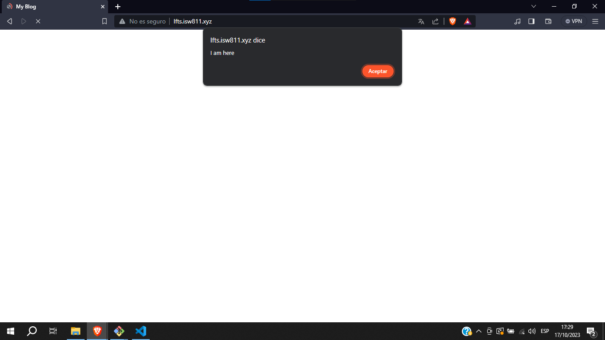

Ademas de esto desvincularemos `app.js` de nuestra pagina.

```html
<!DOCTYPE html>
<html lang="en">
<head>
    <meta charset="UTF-8">
    <meta name="viewport" content="width=device-width, initial-scale=1.0">
    <link rel="stylesheet" href="./css/app.css">
    <title>My Blog</title>
</head>
<body>
    <h1>Hello World</h1>
</body>
</html>
```

Vamos a crear un articulo dentro de nuestra web, por lo que utilizamos el siguiente codigo.

```html
<!DOCTYPE html>
<html lang="en">
<head>
    <meta charset="UTF-8">
    <meta name="viewport" content="width=device-width, initial-scale=1.0">
    <link rel="stylesheet" href="./css/app.css">
    <title>My Blog</title>
</head>

<body>
    <article>

        <h1>Mi primer post</h1>

        <p> Lorem ipsum dolor sit amet consectetur adipisicing elit. Voluptate saepe autem mollitia impedit et. Et quasi, officiis maxime, animi accusantium ipsum minus sequi nobis culpa iure error nihil dolorem omnis.</p>
    
    </article>

</body>
</html>
```

Ahora podemos visualizar el primer post en nuestra web

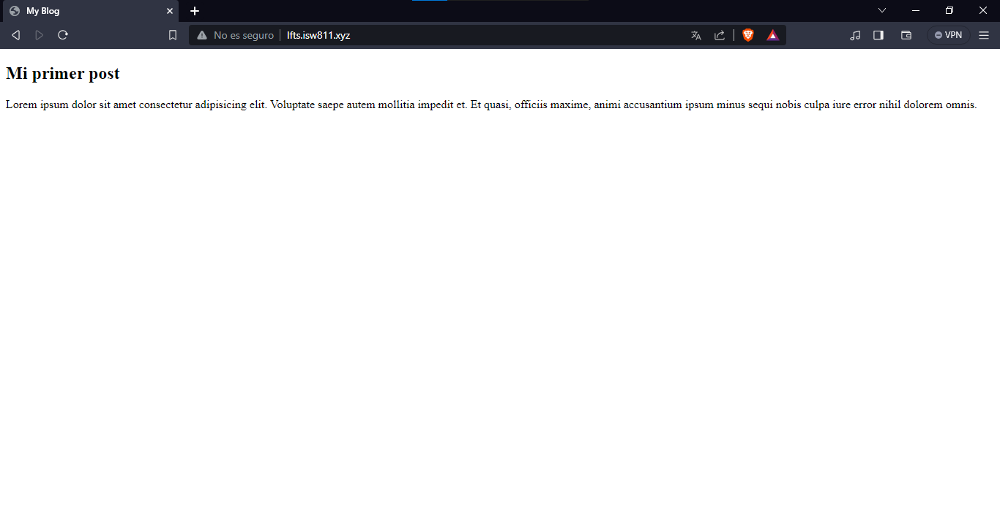

Vamos a duplicar nuestro primer post 2 veces mas para tener 3 posts en la web y vamos a editar el archivo css para darle mejor diseño

```html
<!DOCTYPE html>
<html lang="en">
<head>
    <meta charset="UTF-8">
    <meta name="viewport" content="width=device-width, initial-scale=1.0">
    <link rel="stylesheet" href="./css/app.css">
    <title>My Blog</title>
</head>

<body>
    <article>

        <h1>Mi primer post</h1>

        <p> Lorem ipsum dolor sit amet consectetur adipisicing elit. Voluptate saepe autem mollitia impedit et. Et quasi, officiis maxime, animi accusantium ipsum minus sequi nobis culpa iure error nihil dolorem omnis.</p>
    
    </article>

    <article>

        <h1>Mi segundo post</h1>

        <p> Lorem ipsum dolor sit amet consectetur adipisicing elit. Voluptate saepe autem mollitia impedit et. Et quasi, officiis maxime, animi accusantium ipsum minus sequi nobis culpa iure error nihil dolorem omnis.</p>
    
    </article>
    
    <article>

        <h1>Mi tercer post</h1>

        <p> Lorem ipsum dolor sit amet consectetur adipisicing elit. Voluptate saepe autem mollitia impedit et. Et quasi, officiis maxime, animi accusantium ipsum minus sequi nobis culpa iure error nihil dolorem omnis.</p>
    
    </article>

</body>
</html>
```

```css
body {
    background: white;
    color: black;
    max-width: 600px;
    margin: auto;
    font-family: sans-serif;
}

p {
    line-height: 1.6;
}

article + article {
    margin-top: 3rem;
    padding-top: 3rem;
    border-top: 1px solid gray;
}
```

Vista de la pagina con sus respectivos cambios

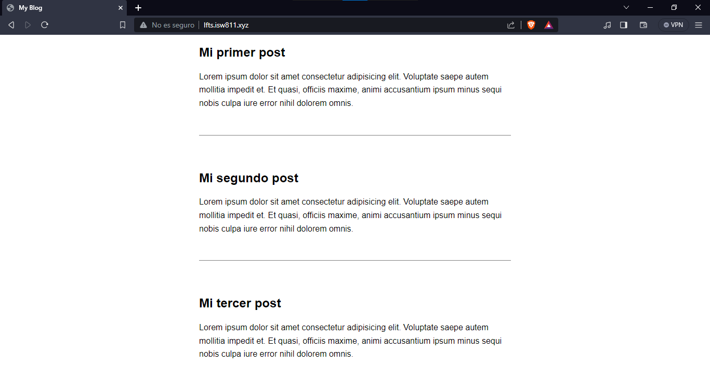

Ahora nos vamos a dirigir a la carpeta `routes` y vamos a crear una nueva ruta a la que llamaremos ``post``

```php
Route::get('post', function () {
    return view('post');
});
```

Modificamos el archivo ``posts`` para agregarle al titulo de los post un link.

```html
<!DOCTYPE html>
<html lang="en">
<head>
    <meta charset="UTF-8">
    <meta name="viewport" content="width=device-width, initial-scale=1.0">
    <link rel="stylesheet" href="./css/app.css">
    <title>My Blog</title>
</head>

<body>
    <article>

        <h1><a href="/post">Mi primer post</a></h1>

        <p> Lorem ipsum dolor sit amet consectetur adipisicing elit. Voluptate saepe autem mollitia impedit et. Et quasi, officiis maxime, animi accusantium ipsum minus sequi nobis culpa iure error nihil dolorem omnis.</p>
    
    </article>

    <article>

        <h1><a href="/post">Mi segundo post</a></h1>

        <p> Lorem ipsum dolor sit amet consectetur adipisicing elit. Voluptate saepe autem mollitia impedit et. Et quasi, officiis maxime, animi accusantium ipsum minus sequi nobis culpa iure error nihil dolorem omnis.</p>
    
    </article>
    
    <article>

        <h1><a href="/post">Mi tercer post</a></h1>

        <p> Lorem ipsum dolor sit amet consectetur adipisicing elit. Voluptate saepe autem mollitia impedit et. Et quasi, officiis maxime, animi accusantium ipsum minus sequi nobis culpa iure error nihil dolorem omnis.</p>
    
    </article>

</body>
</html>
```

Ahora veremos que nuestros titulos son clickeables y nos redirigen a post pero este aun no funciona

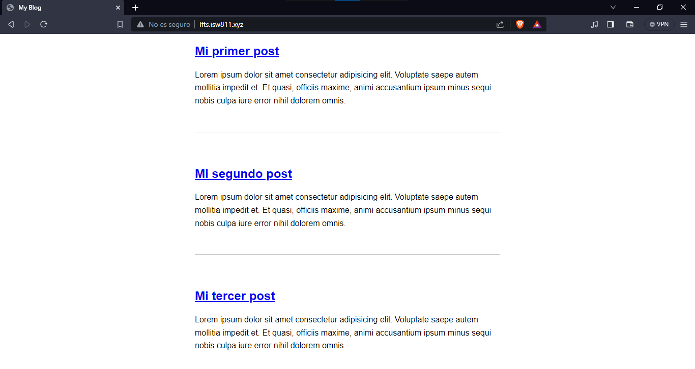

Ahora nos dirigimos a la carpeta _/resources/views_ y vamos a crear un nuevo archivo al que llamaremos `post`

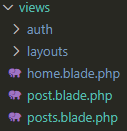

Ahora dentro de este nuevo archivo vamos a copiar el html para que muestre uno de los post

```html
<!DOCTYPE html>
<html lang="en">
<head>
    <meta charset="UTF-8">
    <meta name="viewport" content="width=device-width, initial-scale=1.0">
    <link rel="stylesheet" href="./css/app.css">
    <title>My Blog</title>
</head>

<body>
    <article>

        <h1><a href="/post">Mi primer post</a></h1>

        <p> Lorem ipsum dolor sit amet consectetur adipisicing elit. Voluptate saepe autem mollitia impedit et. Et quasi, officiis maxime, animi accusantium ipsum minus sequi nobis culpa iure error nihil dolorem omnis.</p>
    
    </article>
    <a href="/">Volver</a>

</body>
</html>
```

Y asi se veria al clickear en el titulo de un post


## Almacenar publicaciones de blog como archivos HTML / Store Blog Posts as HTML Files

Empezando con este tema lo que haremos sera editar el archivo `post` con el siguiente codigo, esto para que esa etiqueta php reciba una variable ``post``.

```html
<!DOCTYPE html>
<html lang="en">
<head>
    <meta charset="UTF-8">
    <meta name="viewport" content="width=device-width, initial-scale=1.0">
    <link rel="stylesheet" href="./css/app.css">
    <title>My Blog</title>
</head>

<body>
    <article>

    <?php= $post; ?>

    </article>

    <a href="/">Volver</a>

</body>
</html>
```

Ahora nos moveremos a ``web.php`` y añadimos lo siguiente en la ruta de post

```php
Route::get('post', function () {
    return view('post', [
        'post' ⇒ '<h1>Hello World</h1>'
    ]);
});
```

Y ahora al ingresar al link del titulo del post se despliega lo siguiente

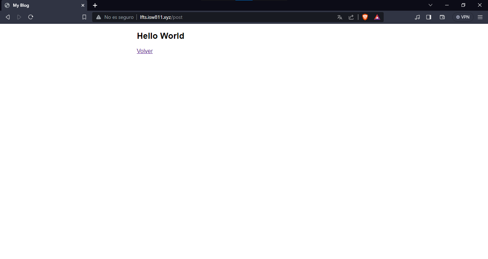

Lo siguiente será crear una carpeta con el nombre `post` dentro de la carpeta _resources_

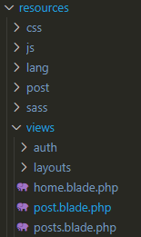

Y dentro de la carpeta `post` vamos a crear un archivo llamado `my-firts-post.html`

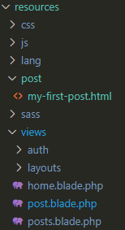

Ahora dentro del archivo `my-firts-post.html` vamos a agregar este codigo

```html
<h1><a href="/post">Mi primer post</a></h1>

<p> Lorem ipsum dolor sit amet consectetur adipisicing elit. Voluptate saepe autem mollitia impedit et. Et quasi,
    officiis maxime, animi accusantium ipsum minus sequi nobis culpa iure error nihil dolorem omnis.</p>
```

Y asi repetimos 3 veces mas para lograr obtener nuestros 3 post

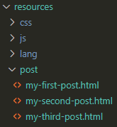

Ahora vamos a editar el archivo ``web.php`` en el que añadiremos lo siguiente.

```php
Route::get('post', function () {
    return view('post', [
        'post' => file_get_contents(__DIR__ . '/../resources/post/my-first-post.html')
    ]);
});
```

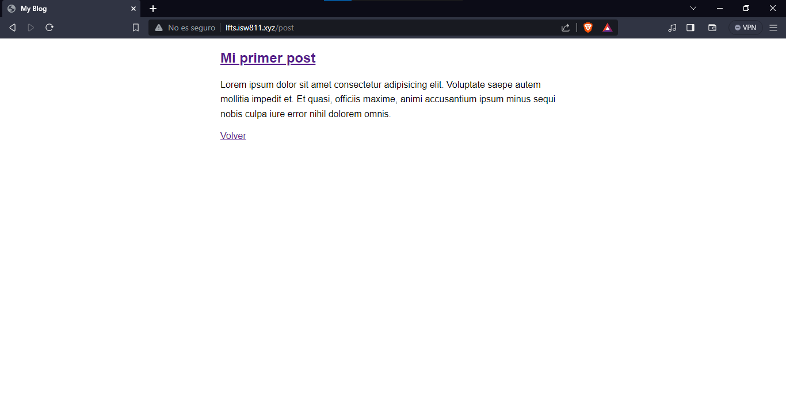

Ahora para lograr que el codigo sea dinamico y podamos ingresar al post seleccionado vamos a utilizar el siguiente codigo

```php
Route::get('posts/{post}', function ($slug) {

    $post = file_get_contents(__DIR__ . '/../resources/post/{$slug}.html');

    return view('post', [
        'post' => $post
    ]);
});
```

Ahora con este codigo lo que logramos fue poder ingresar al html ya sea del primer, segundo o tercer post por medio de la URL utilizando ``$slug``

```php
Route::get('posts/{post}', function ($slug) {

    $post = file_get_contents(__DIR__ . "/../resources/posts/{$slug}.html");
    
    return view('post', [
        'post' => $post
    ]);
});
```

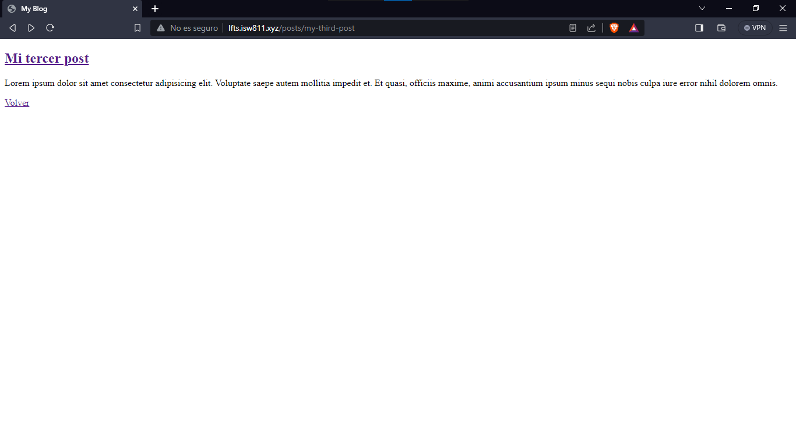

Ahora vamos a validar que la ruta sea valida, por lo que vamos a cambiar el codigo

```php
Route::get('posts/{post}', function ($slug) {

    $path = __DIR__ . "/../resources/posts/{$slug}.html";

    if (! file_exists($path)) {
        dd('el archivo no existe');
    }

    $post = file_get_contents($path);

    return view('post', [
        'post' => $post
    ]);
});
```

Ahora si por alguna razon la ruta a la que deseamos acceder no existe la pagina devovlera la siguiente pagina

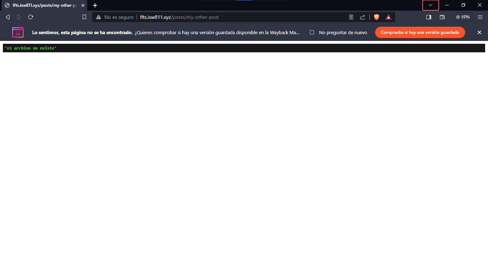

Y si cambiamos `dd` por `ddd` se veria de esta manera 

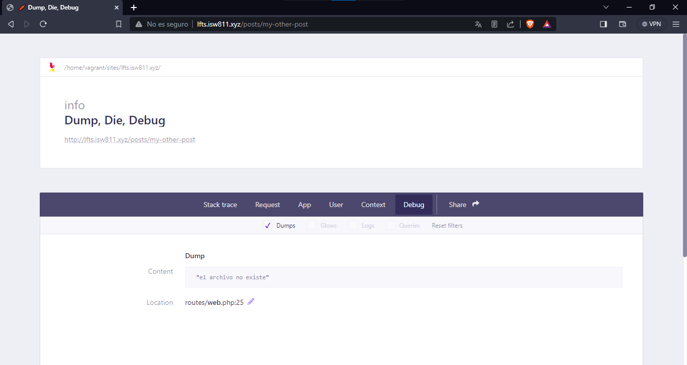

O si queremos que cuando se intente acceder a una ruta no existente podemos devovler la pagina a la pagina principal con el siguiente codigo

```php
Route::get('posts/{post}', function ($slug) {

    $path = __DIR__ . "/../resources/posts/{$slug}.html";

    if (! file_exists($path)) {
        //dd('el archivo no existe');
        //ddd('el archivo no existe');
        //abort(404);
        return redirect('/');
    }

    $post = file_get_contents($path);

    return view('post', [
        'post' => $post
    ]);
});
```

Ahora vamos a cambiar actualizar las rutas de los post para que no de error a la hora de ingresar desde la pagina principal

```html
<!DOCTYPE html>
<html lang="en">
<head>
    <meta charset="UTF-8">
    <meta name="viewport" content="width=device-width, initial-scale=1.0">
    <link rel="stylesheet" href="./css/app.css">
    <title>My Blog</title>
</head>

<body>
    <article>

        <h1><a href="/posts/my-first-post">Mi primer post</a></h1>

        <p> Lorem ipsum dolor sit amet consectetur adipisicing elit. Voluptate saepe autem mollitia impedit et. Et quasi, officiis maxime, animi accusantium ipsum minus sequi nobis culpa iure error nihil dolorem omnis.</p>
    
    </article>

    <article>

        <h1><a href="/posts/my-second-post">Mi segundo post</a></h1>

        <p> Lorem ipsum dolor sit amet consectetur adipisicing elit. Voluptate saepe autem mollitia impedit et. Et quasi, officiis maxime, animi accusantium ipsum minus sequi nobis culpa iure error nihil dolorem omnis.</p>
    
    </article>
    
    <article>

        <h1><a href="/posts/my-third-post">Mi tercer post</a></h1>

        <p> Lorem ipsum dolor sit amet consectetur adipisicing elit. Voluptate saepe autem mollitia impedit et. Et quasi, officiis maxime, animi accusantium ipsum minus sequi nobis culpa iure error nihil dolorem omnis.</p>
    
    </article>

</body>
</html>
```

## Restricciones de rutas / Routes wildcard constraints

Para agregar restricciones a nuestras rutas debemos hacer lo siguiente

```php
Route::get('posts/{post}', function ($slug) {

    $path = __DIR__ . "/../resources/posts/{$slug}.html";

    if (! file_exists($path)) {
        //dd('el archivo no existe');
        //ddd('el archivo no existe');
        //abort(404);
        return redirect('/');
    }

    $post = file_get_contents($path);

    return view('post', [
        'post' => $post
    ]);

})->where('post', '[A-z_\-]+'); 
```

Esto hace que nuestras rutas unicamente acepten letras, lo que nsootros queramos.

## Utilización de caché para operaciones costosas / Use caching for expensive operations

Para recordar las paginas en caché y no tener que cargar todo el contenido cada que recarguemos la página, vamos a agregar lo siguiente al codigo del archivo `web.php`

```php
Route::get('posts/{post}', function ($slug) {

    if (! file_exists($path = __DIR__ . "/../resources/posts/{$slug}.html")) {
        //dd('el archivo no existe');
        //ddd('el archivo no existe');
        //abort(404);
        return redirect('/');
    };

    $post = cache()->remember("posts.{$slug}", 3600, fn () => file_get_contents($path));

    return view('post', ['post' => $post]);

})->where('post', '[A-z_\-]+'); 
```

## Utilización de sistema de clases para leer directorios / Use the filesystem class to read a directory

Primero vamos a editar el codigo de `web.php` añadiendo lo siguiente

```php
Route::get('posts/{post}', function ($slug) {
    // Encontrar un post por medio del slug y pasarlo a la vista de ese post

    $post = Post::find($slug);

    return view('post', [
        'post' => $post
    ]);

})->where('post', '[A-z_\-]+');
```

Luego vamos a la ruta _app/Models_ y vamos a crear una nueva clase llamada Post.php
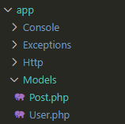

Dentro del archivo `Post.php` añadimos el siguiente codigo 

```php
<?php

namespace App\Models;

class Post
{
    public static function find($slug) {

        if (! file_exists($path = resource_path("posts/{$slug}.html"))) {
            abort(404);
        }

    return cache()->remember("posts.{$slug}", 1200, fn() => file_get_contents($path));

    }
}
```

Y el archivo `web.php` ahora quedaría de esta manera

```php
Route::get('posts/{post}', function ($slug) {

    $post = Post::find($slug);

    return view('post', [
        'post' => $post
    ]);

})->where('post', '[A-z_\-]+'); 
```

Por lo tanto el archivo web.php quedaria mas limpio, y el archivo post se estaria volviendo la clase para volver dinamica la ruta de los distintos post que creamos posteriormente.

Ahora vamos a modificar el archivo `posts` para cargar los post desde sus respectivos html dinamicamente.

El codigo en el archivo posts quedaria de esta manera

```php
<!DOCTYPE html>
<html lang="en">
<head>
    <meta charset="UTF-8">
    <meta name="viewport" content="width=device-width, initial-scale=1.0">
    <link rel="stylesheet" href="./css/app.css">
    <title>My Blog</title>
</head>

<body>

<?php foreach ($posts as $post) : ?>

    <article>
        <?=  $post; ?>
    </article>

<?php endforeach; ?>

</body>
</html>
```

Y posterior a esto iremos a modificar la ruta principal en `web.php`

```php
Route::get('/', function () {

    return view('posts', [
        'posts' => Post::all();
    ]);
});
```

Ahora nos dirigimos a la clase Post para crear el metodo ``all()`` y así quedaría todo el codigo de la clase Post

```php
<?php

namespace App\Models;

use Illuminate\Support\Facades\File;

class Post
{
    public static function all() {

        $files = File::files(resource_path("posts/"));

        return array_map(fn($file) => $file -> getContents(), $files);
    }

    public static function find($slug) {

        if (! file_exists($path = resource_path("posts/{$slug}.html"))) {
            abort(404);
        }

    return cache()->remember("posts.{$slug}", 1200, fn() => file_get_contents($path));

    }
}
```

Luego revisamos que se cargue todo de manera dinamica dentro de nuestra pagina web.

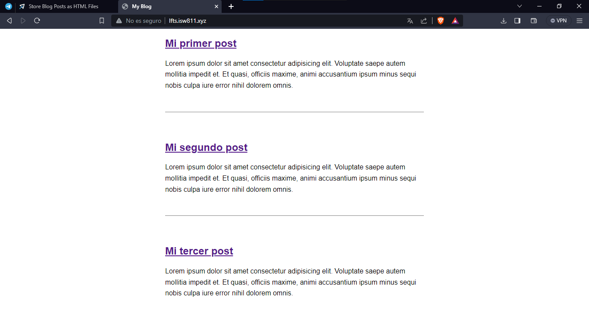

Luego vamos a crear un cuarto post para asegurarnos de que al crear un nuevo post este se cargue de manera dinamica

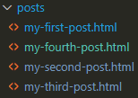

De esta manera quedaría el html dentro del nuevo post

```html
<h1>Mi cuarto post</h1>

<p> Lorem ipsum dolor sit amet consectetur adipisicing elit. Voluptate saepe autem mollitia impedit et. Et quasi,
    officiis maxime, animi accusantium ipsum minus sequi nobis culpa iure error nihil dolorem omnis.</p>
```

Revisamos que se cargue en la pagina principal

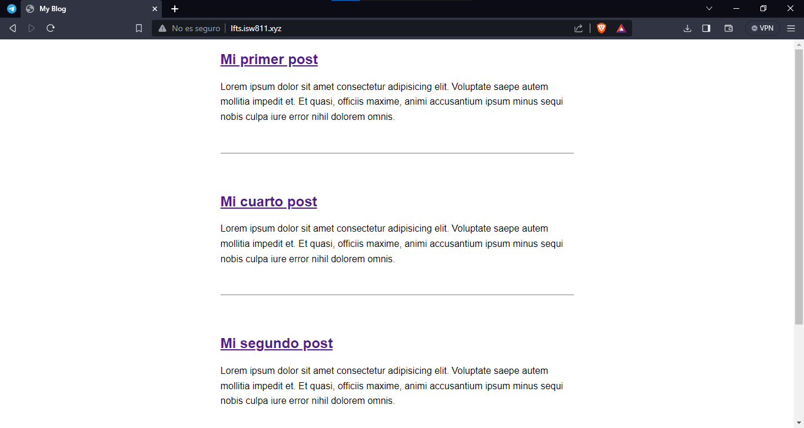

