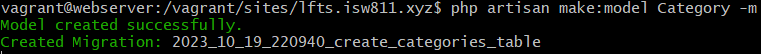
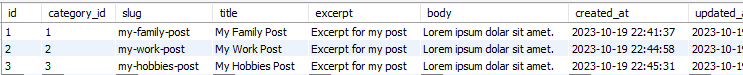

[<--- Volver](/README.md)

# Working with databases

## Archivos de entorno y conexiones de bases de datos / Environment Files and Database Connections

Los archivos de entorno nos ayudan a tener privatizados algunos datos sobre nuestro proyecto que no queremos que salgan a la luz, por ejemplo las conexiones a nuestra base de datos, y para eso se utilizan las varibales .env, dentro del arhivo .env se establecen varables para lo que quieras mentener en secreto por ejemplo API Keys o en nuestro caso la conexion a la base de datos.

Ademas de hacer los cambios para poder conectarnos  al abse de datos vamos a utlizar un software como MySQL Workbench para tener una mejor interfaz de la base de datos.

## Migraciones: conceptos básicos absolutos / Migrations: The Absolute Basics

Para crear migraciones en la base de datos utilizamos el comando

```bash
php artisan migrate
```

Y para volver atras de una migración utilizamos el comando

```bash
php artisan migrate:rollback
```

Aca añadiré los demás comandos que se pueden utilizar con ``migrate``


Para que los cambios que realizamos en el esquema de la base de datos en los archivos de migracion, tenemos que utilizar los comandos 


```bash
php artisan migrate:rollback
php artisan migrate

// O por el contrario podemos utilizar

php artisan migrate:fresh
```

## Elocuente y el patrón de registro activo / Eloquent and the Active Record Pattern

Ahora vamos a crear un usuario directamente desde nuestra terminal de comandos, por lo que vamos a ingresar a la VM webserver y vamos a correr los siguientes comandos


```php
php artisan tinker

$user = new App\Models\User;

$user = new User;

$user->name = 'Andres Salas'

$user->email = 'andressalas@gmail.com'

$user->password = bcrypt('!password')

$user->save();
```

Ahora vamos a Workbench a verificar si nuestro nuevo usuario fue creado


Como podemos visualizar nuestro usuario fue creado perfectamente.

Ahora si dentro de la terminal de comandos utilizamos la variable ``$user` podremos observar la información del usuario recientemente creado


Tambien podemos realizar cambios sobre ese mismo objeto, de la siguiente manera

```bash
$user->name = 'John Doe';

$user->save();
```

Podemos visualizar como los cambios son mostrados la proxima vez que llamemos la variable


Tambien podemos buscar usuarios por medio del ID de la siguiente manera


En mi caso yo ya tenia un usuario guardado en la base de datos, pero para buscar el recien creado utilizamos el mismo coamdno con el id `2`


Tambien podemos llamar todos los usuarios de esta manera


Podemos guardar el resultado de esta funcion dentro de una variable


Y retornar lo que queramos de esta variable


Tambien podemos retornar el primer dato de esa variable


O tambien podemos hacerlo como un array


## Crear un modelo de Post y migrarlo / Make a Post Model adn Migration

Vamos a eliminar la clase Post que creamos para crar una nueva con un modelo elocuente.


Ahora nos dirigimos a la terminal de comandos y junto a _php artisan_ vamos a utilizar una extension llamada ``make` la cual funciona para crear archivos.

Primero utilizamos este comando para crear una tabla de post

```bash
php artisan make:migration create_post_table
```


Y como podemos observar, en la carpeta de migrations en el folder de nuestro proyecto se creó una nueva migracion


Ahora eliminamos la carpeta posts que habiamos creado en el pasado ya que ahora los posts se cargaran desde la base de datos

 


Ahora vamos a la migracion de posts y editamos el codigo

```php
public function up()
    {
        Schema::create('posts', function (Blueprint $table) {
            $table->id();
            $table->string('title');
            $table->text('excerpt');
            $table->text('body');
            $table->timestamps();
            $table->timestamp('published_at')->nullable();
        });
    }
```

Ahora nos movemos a la terminal y migramos la tabla a la base de datos


Y ahora checamos en Workbench que nuestra nueva tabla haya sido creada correctamente


Ahora vamos a crear el respectivo modelo elocuente, recordar que el nombre del modelo siempre debe ser el nombre de la tabla preo en singular, en este caso la tabla se llama ``posts`` y el modelo se llama ``Post``


Y ahora podemos observar que tenemos una clase Post en nuestra caperta de modelos


Ahora vamos a utilizar tinker y vamos a intentar traer todos los posts que tengamos en la base de datos, aunque de momento no tenemos ninguno.


Tambien podemos utilizar count() para verificar cuantos posts tenenmos en la base de datos


Ahora vamos a crear un nuevo post desde la terminal


Revisamos Workbench para visualziar nuestro nuevo posts


Y desde nuestra terminal volvemos a utilizar las funciones de count() y all()


Ahora vamos a cambiar en el archivo ``web.php`` el siguiente codigo ya que no necesitamos pasar el slug, si no el id del post

```php
Route::get('posts/{post}', function ($id) {

    return view('post', [
        'post' => Post::findOrFail($id)
    ]);
});
```

Y ahora visualizamos la pagina web para comprobar que todo este en orden.


Y ahora necesitamos cambiar en el archivo ``posts.blade.php`` el _slug_ por _id_

```php
@extends('layouts.layout')

@section('content')
    @foreach ($posts as $post)
        <article>
            <h1><a href="/posts/{{ $post->id }}"> {{$post->title}} </a></h1>
            <div>
                {{$post->excerpt}}
            </div>
        </article>
    @endforeach
@endsection
```

Y como podemos ver ahora podemos ingresar al post y se carga la infromación.


Vamos a crear un post mas


Y visualizamos la web para visualizar nuestro nuevo post


## Actualizaciones elocuentes y escaneo HTML / Eloquent Updates and HTML Escanping

Vamos a cambiar el body del posts para que al cargarse en el html este se cargue en una etiqueta ``<p>`` en vez de cargarse en texto plano.


Ahora vemos como nuestro posts esta en una etiqueta <p> en vez de en texto plano y se carga el css de la etiqueta.


Ahora repetimos el mismo proceso con el otro post.


Para poder cargar etiquetas desde la base de datos hay que tener la etique donde se cargue la informacion de esta manera. {!! $post->title !!}, de lo contrario no funcionaria.

```php
@extends('layouts.layout')

@section ('content')
    <article>

        <h1> {!! $post->title !!} </h1>

        <div>
            {!! $post->body !!}
        </div>

    </article>

    <a href="/">Volver</a>
@endsection
```

Ahora vamos a guardar una alerta en el titulo del primer post. Esto es normalmente utilizado para inyectar codigo malisioso dentro de nuestro codigo.


Y vemos como al cargar la web podemos visualizar la alerta.


Cualquier persona que cree un post dentro de nuestra web y sepa un poco del tema podria inyectar javascript dentro de nuestro codigo por lo que lo conveniente sería mantener las etiquetas de esta manera <h1> {{ $post->title }} </h1> para evitar esos problemas, ahora vi visualizamos la web, la alerta ya no cargaría.


## Tres formas de mitigar las vulnerabilidades de las asignaciones masivas / 3 Ways to Mitigate Mass Assignment Vulnerabilities

Vamos a crear un nuevo post


Ahora vamos a agregar un parametro nuevo en la clase de Post para poder mitigar ciertas vulnerabilidades dentro de los Post, lo que no este dentro de este nuevo atributo será ignorado a la hora de crear el post, para esto utilziamos $fillable.

```php
protected $fillable = ['title', 'excerpt', 'body'];
```

Ahora creamos un nuevo post, pero ademas de title, excerpt y body, agregaremos id y veremos como este será ignorado


Tambien esta el atributo $guarded que lo que hace es rellenar todos los atributos a escepción de los guardados dentro de la variable

```php
protected $guarded = ['id'];
```

## Enlace del modelo de ruta / Route Model Binding

Vamos a modifcar el codigo en el archivo ``web.php`` esta modificacion funciona exactamente que la anterior cuando se le pasaba el id del post por parametro, solo que como en el wildcard estamos pasando _{post}_ en los parametros al ponerlo de esta manera funcionaría igualmente.

```php
Route::get('posts/{post}', function (Post $post) {

    return view('post', [
        'post' => Post::findOrFail($post)
    ]);
});
```


Ahora dentro del archivo de migracion ``create_post`` vamos a añadir un nuevo atributo el cual será el _slug_ este llevará unique() ya que no queremos que el slug se repita.

```php
public function up()
    {
        Schema::create('posts', function (Blueprint $table) {
            $table->id();
            $table->string('slug')->unique();
            $table->string('title');
            $table->text('excerpt');
            $table->text('body');
            $table->timestamps();
            $table->timestamp('published_at')->nullable();
        });
    }
```

Ahora vamos a refrescar la migración para que los cambios se vean reflejados en la base de datos


Ademas de hacer esto, tenemos que ir a la base de datos y hacer un insert de los posts ya creados, ya que al utilizar `fresh` este eliminrá toda la infromación que se encontraba en la tabla

Una vez haber hecho el insert y añadido el slug dentro de ese mismo insert podemos ver como nuestros posts y la tabla tienen el slug


Ahora vamos a `web.php` y editamos el codigo para que no se filtre por id si no por slug

```php
Route::get('posts/{post:slug}', function (Post $post) {

    return view('post', [
        'post' => $post
    ]);
});
```

Además de esto vamos al archivo post.blade.php a pasar por parametro el slug en vez del id

```php
@extends('layouts.layout')

@section('content')
    @foreach ($posts as $post)
        <article>
            <h1><a href="/posts/{{ $post->slug }}"> {{$post->title}} </a></h1>
            <div>
                {{$post->excerpt}}
            </div>
        </article>
    @endforeach
@endsection
```

Ahora vamos a visulizar los cambios en la url de la nuestra web al momento de ingresar en un post


Ahora vamos a ver otro metodo para encontrar el identificador de un post, dentro de la clase Post, vamos a añadir este código.

```php
public function getRouteKeyName()
    {
        return 'slug';
    }
```

Ahora vamos a ``web.php`` y cambiamos los siguiente

```php
Route::get('posts/{post}', function (Post $post) {

    return view('post', [
        'post' => $post
    ]);
});
```

Y ahora visualizamos la web para ver como los post se cargan por el slug aunque no este tipado en el wildcard


## Tu primera relación elocuente / Your Firts Eloquent Relationship

Lo siguiente será figurar las categorias de cada post, para en el futuro poder filtrar por categoría.

Vamos a ver una nueva manera de crear una tabla, en este caso vamos a crear el Model de Category y vamos a agregar -m para crear la migración que posteriormente se convertirá en una tabla de la base de datos.



Como vemos se creó tanto el Model como la migración.


En la migración modificaremos el codigo para agregar las columnas que necesitamos

```php
public function up()
    {
        Schema::create('categories', function (Blueprint $table) {
            $table->id();
            $table->string('name');
            $table->string('slug');
            $table->timestamps();
        });
    }
```

Y ahora crearemos una foreign key para enlazar la tabla categories con la de posts

```php
public function up()
    {
        Schema::create('posts', function (Blueprint $table) {
            $table->id();
            $table->foreignId('category_id');
            $table->string('slug')->unique();
            $table->string('title');
            $table->text('excerpt');
            $table->text('body');
            $table->timestamps();
            $table->timestamp('published_at')->nullable();
        });
    }
```

Y ahora refrescamos la base de datos para agregar la nueva tabla y la nueva columna


Y como vemos ya estaría la nueva tabla creada y la nueva columna en la tabla posts


Ahora vamos a crear una nueva catergoría en la base de datos


Vamos a crear dos más.


Ahora en nuestra base de datos tenemos 3 categorias.


Creamos nuevos post


Ya que tenemos un post creado vamos a hacer un select en el workbench donde la categoría sea 1


Ahora creamos otros dos post más


Y vemos en la base de datos los 3 posts



Ahora vamos a la Post a crear la relación elocuente

```php
public function category() {
        return $this->belongsTo(Category::class);
    }
```

Y ahora en nuestra terminal podemos visualizar los detalles del post y de su categoria


Editamos el archivo post.blade.php para que tambien muestre en la vista la cterogria de post

```php
@extends('layouts.layout')

@section('content')
    @foreach ($posts as $post)
        <article>
            <h1>
                <a href="/posts/{{ $post->slug }}"> {{$post->title}} </a>
            </h1>

            <p>
                <a href="#"> {{ $post->category->name }} </a>
            </p>

            <div>
                {{$post->excerpt}}
            </div>
        </article>
    @endforeach
@endsection
```

Visualizamos la pagina


Y como vemos los posts se cargan son su respectiva categoría.

## Mostrar todas las publicaciones asociadas con una categoría / Show All Posts Associated With a Category

Creamos una nueva ruta en web.php

```php
Route::get('categories/{category}', function (Category $category) {

    return view('posts', [
        'posts' => $category->posts
    ]);
});
```

Creamos una nueva funcion en la clase Category para llamar todos los post que tienen esa misma categoría

```php
public function posts() {
        return $this->hasMany(Post::class);
    }
```

Revisamospor  en la terminal como funciona esta nueva función


Ahora modificamos las vistas para poder cargar las categorias por medio del slug y no del id

```php
//post.blade.php
@extends('layouts.layout')

@section ('content')
    <article>

        <h1> {{ $post->title }} </h1>

        <p>
            <a href="/categories/{{ $post->category->slug }}"> {{ $post->category->name }} </a>
        </p>

        <div>
            {!! $post->body !!}
        </div>

    </article>

    <a href="/">Volver</a>
@endsection
```

```php
//posts.blade.php
@extends('layouts.layout')

@section('content')
    @foreach ($posts as $post)
        <article>
            <h1>
                <a href="/posts/{{ $post->slug }}"> {{$post->title}} </a>
            </h1>

            <p>
                <a href="/categories/{{ $post->category->slug }}"> {{ $post->category->name }} </a>
            </p>

            <div>
                {{$post->excerpt}}
            </div>
        </article>
    @endforeach
@endsection
```
Editamos la funcion de la ruta en web.php para que busque la categoria por el slug

```php
Route::get('categories/{category:slug}', function (Category $category) {

    return view('posts', [
        'posts' => $category->posts
    ]);
});
```

Y visualizamos la pagina de la categoría donde se cargan todos los posts asociados a esa categoría


## El mecanismo de relojería y el problema N+1 / Clockwork, and the N+1 Problem

Tenemos un problema y es que cuando se estan cargando los posts en la main page se esta corriendo el mismo query 3 veces y eso ralentiza pa pagina, por lo que lo idean sería que solo se cargue una vez.

Vamos a utilizar una herramienta llamada clockwork que instalaremos dentro de nuestra VM websever con el siguiente comando

```bash
$ composer require itsgoingd/clockwork
```


Ademas necesitaremos la extension del navegador que encontramos en el siguiente repositorio de github 

-[Clockwork](https://github.com/itsgoingd/clockwork)

Con esta extension podemos ver desde los dev tools del navegador los querys que se estan corriendo al momento de cargar la pagina


Entonces para resolver esto vamos a editar la ruta en el archivo web.php

```php
Route::get('/', function () {

   return view('posts', [
        'posts' => Post::with('category')->get()
    ]);
});

```

Ahora visualizamos la web y veremos que solo se cargan dos querys pero la pagina sigue funcionando de la misma manera


## La siembra de bases de datos ahorra tiempo / Database Seeding Saves Time


## Turbo Boost con fábricas / Turbo Boost With Factories

## Ver todos los mensajes de un autor / View All Posts by An Author

## Relaciones de carga ansiosas en un modelo existente / Eager Load Relationships on an Existing Model